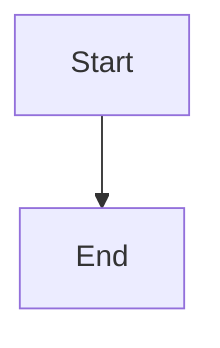

# CLAUDE.md — udoo-playbook

This is the AI assistant context file for working on the **UDOO Playbook** — a VitePress documentation site implementing the UDOO R&D framework (Upstream → Downstream → Onstream → Offstream).

---

## Tech Stack

- **Framework:** VitePress with `vitepress-plugin-mermaid`
- **Package manager:** pnpm
- **Node:** v22 via nvm (source `~/.nvm/nvm.sh` before running commands)
- **Dev server:** `pnpm run dev` → http://localhost:5174
- **Build:** `pnpm run build`
- **Config:** `docs/.vitepress/config.js`

---

## Content Structure

```
docs/
├── guide/          # Foundations, framework intro, Growth Path (5 stages), scale tiers, roles
├── upstream/       # Discovery Workshop (5 stations), Upstream Spiral, refinement practices
├── downstream/     # Delivery: DoD, Gherkin, Kanban, story workflow, dev workflow
├── onstream/       # Operations: SLA/SLO, incidents, runbooks, bug taxonomy, post-mortems
├── offstream/      # Growth: feedback loop, strategic synthesis, health scores, customer lifecycle
├── portfolio/      # Roadmap, cross-team dependencies
├── standards/      # Jira conventions, bug labels, Gherkin tags, tooling, tone
├── tutorials/      # 7 hands-on walkthroughs (chaos-to-flow through incident-to-improvement)
├── examples/       # Real-world initiative briefs, RCAs, post-mortems, stories
└── reference/      # Templates, non-negotiables, phase gates, glossary
```

---

## Key Rules

### Sidebar + Nav Updates
**Every new page MUST be registered in `docs/.vitepress/config.js`.**
- Add to the correct `sidebar` section (matching the directory)
- Add to `nav` only if it's a top-level section
- Never create a page that isn't reachable from the sidebar

### Writing Voice
Follow the principles in `docs/guide/narrative.md`:
- **Human, not corporate.** Write as if explaining to a thoughtful colleague.
- **Problem-first.** Start with the pain or confusion, not the solution.
- **Named personas.** Use Maya, Avi, Noa, Lior, and other named characters — never "the user."
- **Specific, not vague.** "10pm, three sentences, quiet confirmation" > "a good UX."
- **No passive voice.** "The PM writes the story" not "The story is written."
- **Short paragraphs.** Maximum 4 sentences before a line break.

### Mermaid Diagrams
Already configured via `vitepress-plugin-mermaid`. Use freely:
```

```

### Cross-Links
Pages reference each other heavily. **Never remove or rename a page** without updating all inbound links. Search for `link: '/page-name'` in `config.js` and grep for the path in all `.md` files before deleting.

### VitePress Callouts
Use the standard VitePress admonition syntax:
```
::: info
::: tip
::: warning
::: danger
::: details
```

---

## The Framework

UDOO is a 4-phase R&D operating framework with a 4-layer work hierarchy:

### Four Phases

| Phase | Focus | Key outputs |
|---|---|---|
| **Upstream** | Discovery & refinement | Initiative Brief, Feature Brief, DoR-ready Stories |
| **Downstream** | Delivery | Gherkin-tested stories, DoD-verified releases |
| **Onstream** | Operations | Runbooks, SLOs, incident response, blameless post-mortems |
| **Offstream** | Growth & feedback | Health scores, feedback loop, strategic synthesis → next Upstream |

### Four Layers

**Initiative → Feature → Epic → Story**

Each layer has its own practice and team:

| Layer | Upstream Practice | Who Leads |
|---|---|---|
| Initiative | Initiative Discovery (2 weeks, 5-station workshop) | PM + Core Trio (PM, Designer, Tech Lead) |
| Feature | Feature Discovery (1 week, 5-station workshop scoped to feature) | PM + Core Trio |
| Epic | Epic Refinement (2–3 days, story mapping + The Cut + grooming) | PO + Three Amigos (PO, Tech Lead, QA) |
| Story | DoR check (30 min) | PO + Developer |

### Three Types of Upstream Work

Discovery and refinement are fundamentally different practices:

- **Strategic Alignment** — Leadership + PM, quarterly. Direction Map, OKRs, Strategic Synthesis.
- **Discovery** — PM + Core Trio, 5-station workshop. Validates the problem. Produces Initiative Briefs and Feature Briefs.
- **Refinement** — PO + Three Amigos, story mapping + The Cut + grooming. Breaks validated features into buildable stories. Produces DoR-ready stories.

The boundary: **if you don't have a Feature Brief, you're still in discovery. If you do, you're in refinement.**

### The Growth Path (adoption order)

1. **Ship Clean** — DoR + DoD + grooming
2. **Shape Before You Build** — Story mapping + The Cut + Core Trio
3. **Discover Before You Shape** — 5-station workshop + Initiative Discovery
4. **Own What You Ship** — Onstream: SLOs, runbooks, incidents
5. **Close the Loop** — Offstream: feedback loop + strategic synthesis

---

## AI Agentic Behavior

When working on UDOO content or helping teams apply the framework, follow these principles:

### Decompose before producing
Classify work first (Initiative / Feature / Epic / Story / Bug). The wrong classification means the wrong artifact. Use the `/triage` logic before expanding any idea.

### Enter at the right level
Check what artifacts exist. If a Feature Brief is missing, don't write stories — start Feature Discovery. If an Initiative Brief is missing, go there first. Find the lowest level above the work that has no artifact. Start there.

### Recover, don't restart
For existing projects, audit what's in place, trace upward to find the highest documented level, and backfill gaps. Don't throw away existing work — build on it.

### Work in sessions, not monologues
Discovery is conversational. Run one station at a time. Ask questions. Wait for answers. Synthesise. Review. Don't dump a complete brief from a one-sentence prompt.

### Pause at gates
After producing an artifact (Initiative Brief, Feature Brief, Epic with stories), pause for review before moving to the next level. Discovery review → refinement → DoR check → sprint. No level is skipped, no gate is bypassed.

---

## What Not to Do

- Do not add pages to `docs/` without updating `config.js`
- Do not write in corporate/passive voice ("leverage", "utilize", "it is recommended")
- Do not use anonymous users ("the user", "a user") — give them a name
- Do not write feature-first (solution) before problem-first (narrative)
- Do not remove Mermaid diagram blocks — they are intentional and rendered
- Do not break existing anchor links — pages use `#section-name` links extensively
- Do not blur discovery and refinement — they are different practices with different teams
- Do not skip levels in the hierarchy — stories without Feature Briefs will be misbuilt
