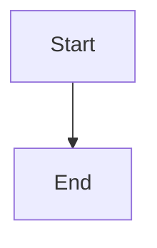

# CLAUDE.md — udoo-playbook

This is the AI assistant context file for working on the **UDOO Playbook** — a VitePress documentation site implementing the UDOO R&D framework (Upstream → Downstream → Onstream → Offstream).

---

## Tech Stack

- **Framework:** VitePress with `vitepress-plugin-mermaid`
- **Package manager:** pnpm
- **Node:** v22 via nvm (source `~/.nvm/nvm.sh` before running commands)
- **Dev server:** `pnpm run dev` → http://localhost:5174
- **Build:** `pnpm run build`
- **Config:** `docs/.vitepress/config.js`

---

## Content Structure

```
docs/
├── guide/          # Introduction, lifecycle, hierarchy, narrative, lite-mode, how-to-use
├── upstream/       # Discovery: 5 stations, DoR, experience snapshot, idea triage, initiative brief, roles, etc.
├── downstream/     # Delivery: DoD, Gherkin, Kanban, story workflow, Jira templates, dev workflow
├── onstream/       # Operations: SLA, SRE, runbooks, incidents, on-call
├── offstream/      # Growth: CS, feedback loops, retention, NPS
├── portfolio/      # OKRs, initiatives tracker, roadmap views
├── standards/      # Cross-cutting standards: branching, observability, API design
├── tutorials/      # Step-by-step walkthroughs (wrong-way/right-way, etc.)
├── examples/       # Real-world implementation examples with named personas
└── reference/      # Quick reference cards, templates, printable checklists
```

---

## Key Rules

### Sidebar + Nav Updates
**Every new page MUST be registered in `docs/.vitepress/config.js`.**
- Add to the correct `sidebar` section (matching the directory)
- Add to `nav` only if it's a top-level section
- Never create a page that isn't reachable from the sidebar

### Writing Voice
Follow the principles in `docs/guide/narrative.md`:
- **Human, not corporate.** Write as if explaining to a thoughtful colleague.
- **Problem-first.** Start with the pain or confusion, not the solution.
- **Named personas.** Use Maya, Avi, and other named characters from the examples — never "the user."
- **Specific, not vague.** "10pm, three sentences, quiet confirmation" > "a good UX."
- **No passive voice.** "The PM writes the story" not "The story is written."
- **Short paragraphs.** Maximum 4 sentences before a line break.

### Mermaid Diagrams
Already configured via `vitepress-plugin-mermaid`. Use freely:
```

```

### Cross-Links
Pages reference each other heavily. **Never remove or rename a page** without updating all inbound links. Search for `link: '/page-name'` in `config.js` and grep for the path in all `.md` files before deleting.

---

## The Framework

UDOO is a 4-layer R&D operating framework:

| Phase | Focus | Key outputs |
|---|---|---|
| **Upstream** | Discovery & alignment | Initiative Brief, Experience Snapshot, User Stories (DoR) |
| **Downstream** | Delivery | Sprint, Gherkin-tested stories, DoD-verified releases |
| **Onstream** | Operations | Runbooks, SLAs, incident response, blameless post-mortems |
| **Offstream** | Customer growth | CS feedback, retention signals, NPS → feeds next Upstream |

**The 4-layer story hierarchy:** Initiative → Feature → Epic → Story → Subtask

**User story format:** `As [named persona], I want [action], so that [outcome].`

**DoR 9-point checklist:** format, journey reference, acceptance criteria, visual reference, copy, observability signal, dependencies, size (1-3 days), tech feasibility.

---

## What Not to Do

- Do not add pages without updating `config.js`
- Do not write in corporate/passive voice
- Do not use anonymous "the user" — give personas names
- Do not remove Mermaid diagram blocks
- Do not break existing anchor links
