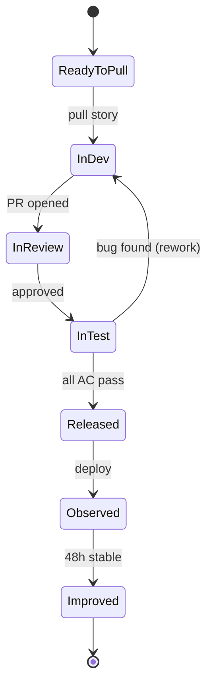

# Developer Workflow — End to End

<span class="phase-badge downstream">🟢 Downstream</span>

This chapter follows a single story — **MOM-234 "Save a reflection"** from the Living Wondrously Journal — through every stage of the Downstream workflow. From the moment a developer pulls it off the board to the moment it is observed in production, this is what a day (and a half) looks like.

::: info Why a Narrative?
Process documentation describes *what should happen*. A narrative shows *what it actually feels like*. This chapter is both — the rules are embedded in the story, and the story makes the rules real.
:::

---

## 1. Morning: Pick a Story

It is 9:15 AM. Noa finishes her coffee, opens the Kanban board, and checks the **In Dev** column. There are 2 stories in flight — the WIP limit is 3. One slot is open.

She moves to **Ready to Pull** and scans from top to bottom (highest priority first). The top story is MOM-234:

```
MOM-234: Save a reflection
──────────────────────────────────────
Epic:     E-LW-01 (Entry Creation)
Priority: High
Points:   3
PM:       Oren
QA:       Lior

Acceptance Criteria:
  AC1: User taps "Save" and the entry is persisted
  AC2: A success confirmation appears for 3 seconds
  AC3: The entry appears in the Past Entries list
  AC4: If save fails, an error message is shown with a retry option
  AC5: Empty entries cannot be saved (Save button is disabled)
```

Noa reads the AC carefully. She checks the linked Figma designs. She reviews the Gherkin scenarios already attached from the Story Kick-Off. Everything is clear — no Three Amigos needed. She assigns herself and drags MOM-234 to **In Dev**.

**Jira transition:** `Ready to Pull → In Dev`
**Time:** 9:20 AM

::: tip When to Call a Three Amigos
Noa skipped the kick-off because the story already had clear AC, linked Gherkin scenarios, and Figma designs. If any of these were missing or ambiguous — "What does 'error message' look like? What errors can occur?" — she would call a 15-minute Three Amigos with the PM and QA before writing a line of code. The rule: **if you have to guess what "done" looks like, stop and ask**.
:::

---

## 2. Story Kick-Off (15 Minutes)

Even though Noa felt confident, she pings Oren (PM) and Lior (QA) for a quick alignment check. They spend 12 minutes on a call.

| Role | Key Question | Outcome |
|------|-------------|---------|
| **Noa (Dev)** | "What if the user is offline when they tap Save?" | AC added: AC6 — "If offline, entry is queued and saved when connectivity returns" |
| **Lior (QA)** | "What if the user taps Save twice rapidly?" | Edge case noted — prevent double submission with button debounce |
| **Oren (PM)** | "The confirmation should feel warm — use the ✨ animation from the design system" | Confirmed — links specific Figma frame |

Three questions. Three clarifications that would have become bugs without this conversation. Twelve minutes well spent.

**Time:** 9:35 AM

---

## 3. Create the Branch

Noa opens her terminal:

```bash
git checkout main
git pull origin main
git checkout -b feature/MOM-234-save-reflection
```

Branch naming follows the convention: `{type}/{ticket-id}-{short-description}`. The ticket ID (`MOM-234`) is the traceability link — Jira's Git integration will automatically show this branch on the story's detail panel. The branch is created from main and will be merged back to main via PR.

**Time:** 9:37 AM

---

## 4. Implement

Noa works for about 4 hours, building three components:

### The Model

```typescript
// models/JournalEntry.ts
export interface JournalEntry {
  id: string
  userId: string
  promptId: string | null
  content: string
  createdAt: Date
  updatedAt: Date
}

export interface SaveEntryRequest {
  promptId?: string
  content: string
}

export interface SaveEntryResponse {
  entry: JournalEntry
  isQueued: boolean
}
```

### The API Endpoint

```typescript
// server/api/entries.post.ts
export default defineEventHandler(async (event) => {
  const user = await requireAuth(event)
  const body = await readValidatedBody(event, saveEntrySchema.parse)

  if (!body.content.trim()) {
    throw createError({ statusCode: 422, message: 'Entry content cannot be empty' })
  }

  const entry = await db.journalEntry.create({
    data: {
      userId: user.id,
      promptId: body.promptId ?? null,
      content: body.content.trim(),
      createdAt: new Date(),
      updatedAt: new Date(),
    },
  })

  setResponseStatus(event, 201)

  analytics.track('journal_entry_saved', {
    userId: user.id,
    promptId: body.promptId,
    contentLength: body.content.length,
    isFirstEntry: await isFirstEntry(user.id),
  })

  return { entry, isQueued: false }
})
```

### The Vue Component

```vue
<!-- components/SaveReflectionButton.vue -->
<template>
  <UButton
    :label="buttonLabel"
    :loading="isSaving"
    :disabled="!canSave"
    icon="i-heroicons-check-circle"
    @click="handleSave"
  />

  <Transition name="fade">
    <div v-if="showConfirmation" class="save-confirmation">
      ✨ Reflection saved
    </div>
  </Transition>

  <UAlert
    v-if="error"
    color="red"
    :title="error.message"
    :actions="[{ label: 'Retry', click: handleSave }]"
  />
</template>

<script setup lang="ts">
const props = defineProps<{
  content: string
  promptId?: string
}>()

const emit = defineEmits<{
  saved: [entry: JournalEntry]
}>()

const isSaving = ref(false)
const showConfirmation = ref(false)
const error = ref<Error | null>(null)

const canSave = computed(() =>
  props.content.trim().length > 0 && !isSaving.value
)

const buttonLabel = computed(() =>
  isSaving.value ? 'Saving…' : 'Save Reflection'
)

let saveTimeout: ReturnType<typeof setTimeout>

async function handleSave() {
  if (!canSave.value) return
  error.value = null
  isSaving.value = true

  try {
    const { entry } = await $fetch('/api/entries', {
      method: 'POST',
      body: { content: props.content, promptId: props.promptId },
    })
    showConfirmation.value = true
    saveTimeout = setTimeout(() => { showConfirmation.value = false }, 3000)
    emit('saved', entry)
  } catch (e) {
    error.value = e as Error
  } finally {
    isSaving.value = false
  }
}

onUnmounted(() => clearTimeout(saveTimeout))
</script>
```

Noa adds the observability event (`journal_entry_saved`) as she builds, not as an afterthought. The event fires on every successful save, capturing content length, prompt ID, and whether this is the user's first entry — data the PM will use to measure engagement.

**Time:** 1:45 PM

---

## 5. Write Tests

### Unit Tests

```typescript
// tests/unit/entries.post.test.ts
describe('POST /api/entries', () => {
  it('creates an entry with valid content', async () => {
    const res = await handler({
      body: { content: 'Today I am grateful for...', promptId: 'p-001' },
      user: mockUser,
    })
    expect(res.entry.content).toBe('Today I am grateful for...')
    expect(res.entry.userId).toBe(mockUser.id)
    expect(res.isQueued).toBe(false)
  })

  it('rejects empty content with 422', async () => {
    await expect(
      handler({ body: { content: '' }, user: mockUser })
    ).rejects.toMatchObject({ statusCode: 422 })
  })

  it('rejects whitespace-only content with 422', async () => {
    await expect(
      handler({ body: { content: '   \n\t  ' }, user: mockUser })
    ).rejects.toMatchObject({ statusCode: 422 })
  })

  it('trims leading and trailing whitespace', async () => {
    const res = await handler({
      body: { content: '  reflection text  ' },
      user: mockUser,
    })
    expect(res.entry.content).toBe('reflection text')
  })

  it('requires authentication', async () => {
    await expect(
      handler({ body: { content: 'text' }, user: null })
    ).rejects.toMatchObject({ statusCode: 401 })
  })
})
```

### Component Tests

```typescript
// tests/components/SaveReflectionButton.test.ts
describe('SaveReflectionButton', () => {
  it('disables Save when content is empty', () => {
    const wrapper = mount(SaveReflectionButton, {
      props: { content: '' },
    })
    expect(wrapper.find('button').attributes('disabled')).toBeDefined()
  })

  it('enables Save when content has text', () => {
    const wrapper = mount(SaveReflectionButton, {
      props: { content: 'My reflection' },
    })
    expect(wrapper.find('button').attributes('disabled')).toBeUndefined()
  })

  it('shows confirmation for 3 seconds after save', async () => {
    vi.useFakeTimers()
    const wrapper = mount(SaveReflectionButton, {
      props: { content: 'My reflection' },
    })

    await wrapper.find('button').trigger('click')
    await flushPromises()

    expect(wrapper.text()).toContain('Reflection saved')

    vi.advanceTimersByTime(3000)
    await nextTick()

    expect(wrapper.text()).not.toContain('Reflection saved')
    vi.useRealTimers()
  })

  it('shows error with retry button on failure', async () => {
    mockFetchError(500)
    const wrapper = mount(SaveReflectionButton, {
      props: { content: 'My reflection' },
    })

    await wrapper.find('button').trigger('click')
    await flushPromises()

    expect(wrapper.text()).toContain('Retry')
  })

  it('emits saved event with entry data', async () => {
    const wrapper = mount(SaveReflectionButton, {
      props: { content: 'My reflection' },
    })

    await wrapper.find('button').trigger('click')
    await flushPromises()

    expect(wrapper.emitted('saved')).toHaveLength(1)
    expect(wrapper.emitted('saved')![0][0]).toHaveProperty('id')
  })
})
```

Noa runs the full test suite locally:

```bash
npm run test:unit -- --run
# ✓ 5 tests in entries.post.test.ts
# ✓ 5 tests in SaveReflectionButton.test.ts
# 10 tests passed, 0 failed
```

**Time:** 2:45 PM

---

## 6. Self-Test

Before opening a PR, Noa runs the app locally and manually verifies every AC:

| AC | Test | Result |
|----|------|--------|
| AC1: Save persists entry | Write text, tap Save, check database | ✅ Entry in DB |
| AC2: Confirmation for 3s | Observe confirmation, count to 3 | ✅ Disappears after 3s |
| AC3: Entry in Past Entries | Navigate to Past Entries list | ✅ New entry at top |
| AC4: Error with retry | Disconnect network, tap Save | ✅ Error shown, retry works |
| AC5: Empty cannot save | Clear text, check button state | ✅ Button disabled |
| Edge: Double-tap | Tap Save rapidly twice | ✅ Only one entry created (debounce works) |
| Edge: Whitespace only | Type only spaces, check button | ✅ Button disabled (trimmed content is empty) |

**Time:** 3:15 PM

---

## 7. Open the PR

Noa pushes her branch and opens a pull request:

```bash
git add .
git commit -m "MOM-234: add journal entry save flow

- JournalEntry model + Zod validation schema
- POST /api/entries endpoint with auth + trimming
- SaveReflectionButton component with confirmation + error states
- Unit tests (5) + component tests (5)
- Analytics event: journal_entry_saved"

git push -u origin feature/MOM-234-save-reflection
```

### PR Description

```markdown
## What
Adds the complete save flow for journal reflections: API endpoint,
Vue component with confirmation/error states, and observability events.

## Why
[MOM-234](https://jira.example.com/browse/MOM-234) — Core S1 story.
Users need to persist their reflections to get value from the journal.
Without save, the app is a notepad that forgets.

## How
- `POST /api/entries` validates input (Zod), trims whitespace, persists
  to PostgreSQL, and emits an analytics event
- `SaveReflectionButton` manages loading, confirmation (3s auto-dismiss),
  and error states with retry. Save button is disabled for empty content.
- Debounce prevents double-submit on rapid taps

## Testing
- [x] 5 unit tests: happy path, empty content, whitespace, trimming, auth
- [x] 5 component tests: disabled state, enabled state, confirmation
      timer, error + retry, event emission
- [x] Self-tested all 5 AC + 2 edge cases locally

## Screenshots
[Save button states: default, saving, confirmed, error]
```

**Jira transition:** `In Dev → In Review`
**Time:** 3:30 PM

---

## 8. Code Review

Amit (senior developer) picks up the PR at 4:10 PM — within the 4-hour review SLA.

### Review Feedback

| File | Comment | Type |
|------|---------|------|
| `entries.post.ts` | "The analytics event fires before the response is sent. If analytics is slow, it delays the user's save. Move it to `event.waitUntil()` or fire-and-forget." | Blocking |
| `SaveReflectionButton.vue` | "Nice debounce approach. Consider also disabling the button during the saving state (you already do via `canSave` — confirmed, looks good)." | Non-blocking |
| `entries.post.test.ts` | "Add a test for content at the max length boundary (10,000 chars). The schema validates max length but there is no test for it." | Blocking |

Noa addresses both blocking comments:

```typescript
// Fix 1: Fire analytics asynchronously
event.waitUntil(
  analytics.track('journal_entry_saved', { /* ... */ })
)
```

```typescript
// Fix 2: Add boundary test
it('accepts content at exactly 10,000 characters', async () => {
  const content = 'a'.repeat(10_000)
  const res = await handler({ body: { content }, user: mockUser })
  expect(res.entry.content).toHaveLength(10_000)
})

it('rejects content exceeding 10,000 characters', async () => {
  const content = 'a'.repeat(10_001)
  await expect(
    handler({ body: { content }, user: mockUser })
  ).rejects.toMatchObject({ statusCode: 422 })
})
```

Noa pushes the fixes. Amit re-reviews and approves.

**Time:** 4:50 PM

---

## 9. Merge & Deploy to Staging

Noa squash-merges the PR into `main`:

```
SFC-42: add journal entry save flow (#87)
```

CI runs automatically on the merge:

```
✓ Lint                    (12s)
✓ Build                   (34s)
✓ Unit Tests              (28s)
✓ Integration Tests       (45s)
✓ Security Scan (SAST)    (1m 12s)
✓ Dependency Audit (SCA)  (18s)
✓ Deploy to Staging       (2m 05s)
✓ Smoke Tests (@smoke)    (1m 40s)
```

All green. The story is now live on staging.

**Jira transition:** `In Review → In Test`
**Time:** 5:10 PM (Noa goes home — QA picks up tomorrow morning)

---

## 10. QA Testing

The next morning, Lior (QA) begins testing MOM-234 on staging.

### Gherkin Scenario Execution

```gherkin
Feature: Journal Entry — Save Reflection
  As a journal user
  I want to save my written reflection
  So that I can revisit it later

  Background:
    Given a user "noa@example.com" is authenticated
    And the user is on the journal writing screen

  @area-frontend @type-happy @smoke
  Scenario: User saves a reflection successfully
    Given the user has written "Today I noticed the light"
    When the user taps "Save Reflection"
    Then the entry is persisted to the database
    And a confirmation message "✨ Reflection saved" appears
    And the confirmation disappears after 3 seconds

  @area-frontend @type-happy
  Scenario: Saved entry appears in past entries
    Given the user has saved a reflection "Today I noticed the light"
    When the user navigates to Past Entries
    Then the entry "Today I noticed the light" appears at the top of the list

  @area-frontend @type-edge
  Scenario: Empty entry cannot be saved
    Given the user has not written any text
    Then the "Save Reflection" button is disabled

  @area-frontend @type-error
  Scenario: Save failure shows error with retry
    Given the save API will return a 500 error
    When the user taps "Save Reflection"
    Then an error message is displayed
    And a "Retry" button is visible
    When the API recovers and the user taps "Retry"
    Then the entry is saved successfully

  @area-frontend @type-edge
  Scenario: Rapid double-tap does not create duplicate entries
    Given the user has written "Single entry"
    When the user taps "Save Reflection" twice within 200ms
    Then only one entry is created in the database
```

Lior runs all 5 scenarios in AssertThat: **4 pass, 1 fails.**

### The Bug

The **double-tap scenario fails**. On staging, with real network latency, the debounce does not prevent a second API call because the button's `disabled` state relies on the `isSaving` ref — but on a fast connection, the first request completes before the second click registers, so `isSaving` flips back to `false` between taps.

Lior files a bug:

```
BUG: MOM-234-B1 — Double-tap creates duplicate journal entries
─────────────────────────────────────────────────────────────
Severity:  P2
Steps:     1. Write any text
           2. Tap Save twice within ~300ms
           3. Navigate to Past Entries
Expected:  One entry
Actual:    Two identical entries
Environment: Staging (v1.2.0-rc.1)
Linked to: MOM-234
```

**Jira transition:** `In Test → In Dev` (story bounced back)

---

## 11. Bug Fix

Noa picks up the bug at 10:30 AM. The fix is a server-side idempotency guard — client-side debounce is necessary but not sufficient.

```typescript
// server/api/entries.post.ts — idempotency addition
const idempotencyKey = getHeader(event, 'x-idempotency-key')
if (idempotencyKey) {
  const existing = await db.journalEntry.findFirst({
    where: { idempotencyKey, userId: user.id },
  })
  if (existing) {
    return { entry: existing, isQueued: false }
  }
}
```

```vue
<!-- SaveReflectionButton.vue — client-side addition -->
<script setup lang="ts">
const idempotencyKey = ref('')

async function handleSave() {
  if (!canSave.value) return
  idempotencyKey.value = crypto.randomUUID()
  // ... existing save logic with idempotencyKey in headers
}
</script>
```

New test added:

```typescript
it('returns existing entry for duplicate idempotency key', async () => {
  const key = 'unique-key-123'
  const first = await handler({
    body: { content: 'text' },
    user: mockUser,
    headers: { 'x-idempotency-key': key },
  })
  const second = await handler({
    body: { content: 'text' },
    user: mockUser,
    headers: { 'x-idempotency-key': key },
  })
  expect(first.entry.id).toBe(second.entry.id)
})
```

Noa pushes the fix, it passes CI, merges to main, deploys to staging.

**Jira transition:** `In Dev → In Review → In Test`
**Time:** 12:00 PM

Lior retests. All 5 Gherkin scenarios pass. Exploratory testing reveals no further issues.

::: warning Bugs Found in Test Are Cheap
The duplicate-save bug cost 90 minutes to find, report, fix, and retest. Had it escaped to production, it would have corrupted user data, generated support tickets, and required a database cleanup script. Finding bugs in Test is the system working as designed.
:::

---

## 12. Design Review

The story includes UI changes, so Yael (designer) reviews the four states on staging:

| State | Expected (Figma) | Actual (Staging) | Verdict |
|-------|------------------|-------------------|---------|
| Empty (no text) | Save button disabled, greyed out | ✅ Matches | Pass |
| Writing (text entered) | Save button active, primary colour | ✅ Matches | Pass |
| Saved (confirmation) | ✨ animation, "Reflection saved" text, 3s fade | ✅ Matches | Pass |
| Error (save failed) | Red alert with retry button | ✅ Matches | Pass |

Yael approves with one non-blocking note: *"The confirmation animation could use a slight ease-out on exit. Not blocking — file as a polish story."*

**Time:** 1:30 PM

---

## 13. Release

The release readiness checklist is walked through:

| Check | Status |
|-------|--------|
| All stories meet DoD | ✅ MOM-234 fully complete |
| No open P1/P2 bugs | ✅ MOM-234-B1 resolved |
| Smoke suite green | ✅ All `@smoke` scenarios pass |
| Performance within SLOs | ✅ Save endpoint p95 = 180ms (SLO: ≤500ms) |
| Rollback plan | ✅ `kubectl rollout undo deployment/journal-api` |
| Monitoring dashboard | ✅ `journal_entry_saved` event visible |
| On-call briefed | ✅ Amit (on-call) reviewed release notes |
| PM sign-off | ✅ Oren tested on staging, confirmed |

Noa's PR is merged to `main` (squash merge). The team tags the release for production:

```bash
git tag -a v1.2.0 -m "Release 1.2.0 (MOM-234, MOM-235)"
git push origin v1.2.0
```

CI deploys to production (on tag push, or manually). Smoke tests pass against production.

**Jira transition:** `In Test → Released`
**Time:** 2:15 PM

---

## 14. Observe

MOM-234 enters the **48-hour stability window**. The team monitors actively.

### Hour 0–4 (Afternoon of Release)

Noa checks the monitoring dashboard:

```
journal_entry_saved events:
  Last 4 hours: 23 events
  Error rate:   0.0%
  p95 latency:  190ms

Comparison to baseline:
  New users writing:  +12% (expected — new save flow is smoother)
  Save failures:      0 (was 3% with old flow due to timeout)
```

### Hour 4–24 (Next Morning)

Oren (PM) checks user feedback channels:

```
Support tickets mentioning "save" or "journal": 0
App store reviews mentioning save: 0
Analytics: 47 reflections saved by 31 unique users
```

### Hour 24–48 (Day 2)

Lior re-runs the smoke suite against production: all green. Amit (on-call) confirms no alerts fired overnight.

**Observation verdict:** Stable. No anomalies. No regressions.

::: details What If Observation Had Found Something?
If the error rate had spiked, or users had reported issues, the team would have:

1. **Severity assessment:** Is this P0 (rollback immediately), P1 (fix within 24h), or P2 (fix in next release)?
2. **P0 path:** Rollback to v1.1.0 → file incident → post-mortem → new story for the fix
3. **P1 path:** Hotfix branch from main → fix → deploy → resume observation
4. **P2 path:** Log as bug → prioritise in next iteration → story moves to Improved

The observation window exists precisely for this triage. Without it, the team assumes success on deploy and misses slow-emerging issues.
:::

---

## 15. Done

After 48 hours with no incidents, MOM-234 transitions to **Improved**.

**Jira transition:** `Released → Observed → Improved`

### What Gets Captured

| Item | Detail |
|------|--------|
| **Learning** | Server-side idempotency is essential for any user-facing write operation — client-side debounce alone is insufficient |
| **Follow-up story** | MOM-260: "Add ease-out animation to save confirmation" (Yael's design polish note) |
| **Retro item** | "Consider adding idempotency middleware as a default for all POST endpoints" |
| **Metrics baseline** | Save p95 = 190ms, daily active writers = 31 (first full day) |

The story is closed. The learning is captured. The next developer who builds a save flow will see the idempotency pattern in the codebase — and in the retro notes.

---

## The Full Timeline

```
DAY 1
──────────────────────────────────────────────────────────
 9:15  Noa checks the board. One WIP slot open.
 9:20  Pull MOM-234 from Ready to Pull → In Dev
 9:35  Story kick-off with Oren (PM) + Lior (QA). 12 min.
 9:37  Create branch: feature/MOM-234-save-reflection
 9:40  Start implementing: model, endpoint, component
 1:45  Implementation complete
 2:45  Tests written: 10 tests, all green
 3:15  Self-test complete: all AC + edge cases verified
 3:30  PR opened: "[MOM-234] Add journal entry save flow"
 4:10  Amit starts code review
 4:50  Review complete. 2 blocking comments → fixed → approved
 5:10  Squash merge to main. CI green. Deployed to staging.

DAY 2
──────────────────────────────────────────────────────────
 9:00  Lior begins QA on staging
 9:45  4 of 5 Gherkin scenarios pass. Double-tap bug found.
10:00  Bug MOM-234-B1 filed. Story bounced to In Dev.
10:30  Noa picks up bug. Adds idempotency guard.
12:00  Fix merged, deployed to staging. Lior retests. All 5 pass.
 1:30  Yael (design) reviews four states. Approved.
 2:15  Release readiness checklist passed. Tag v1.2.0 on main.
       Deployed to production. Smoke tests green.
 2:30  Observation begins. Dashboard monitored.

DAY 2 → DAY 4
──────────────────────────────────────────────────────────
       48-hour stability window. No incidents. No anomalies.

DAY 4
──────────────────────────────────────────────────────────
       Story moves to Improved. Learning captured. Done.
```

### Jira State Transitions



---

## What Made This Work

Looking back at the MOM-234 journey, several framework practices prevented the common failure modes:

| Practice | What It Prevented |
|----------|------------------|
| **Story Kick-Off** | The offline-save edge case and double-tap scenario would have been missed without the QA's questions |
| **Branch naming** | Jira automatically linked the branch, PR, and commits to the story — full traceability |
| **Self-test before PR** | Noa caught 2 edge cases herself instead of wasting reviewer or QA time |
| **4-hour review SLA** | Amit reviewed within 40 minutes. The story did not wait overnight in In Review. |
| **WIP limits** | Only 3 stories in Dev at once. Noa was not context-switching between 5 stories. |
| **Gherkin scenarios** | The double-tap bug was caught because Lior had a specific scenario for it — written during the kick-off |
| **DoD checklist** | Observability events were added during implementation, not forgotten and bolted on post-release |
| **48-hour observation** | The team actively monitored production instead of assuming success on deploy |

::: tip The Invisible Success
The most important outcome is what *didn't* happen: no production incident, no 2 AM hotfix, no customer complaint, no rework sprint. The framework's value is not measured in what it adds — it is measured in what it prevents.
:::

---

## Your Turn

Use MOM-234 as a template for your next story. Print the timeline. Follow the state transitions. Run the kick-off. Open the PR with the template. Walk the DoD checklist. Monitor the observation window.

After 10 stories, the workflow will feel natural. After 50, it will feel fast. After 100, you will not remember how you worked without it.

---

