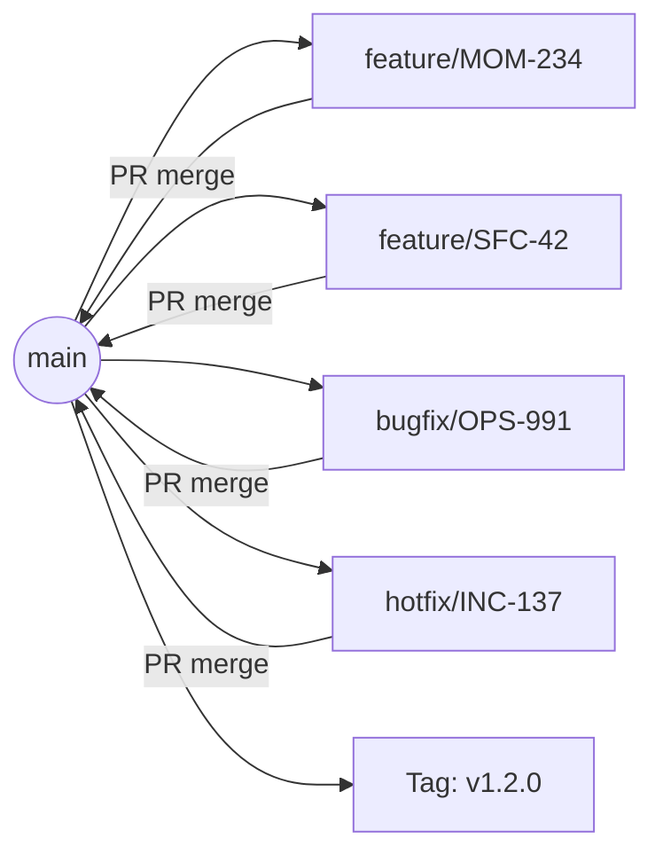
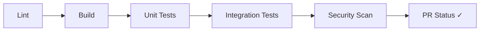
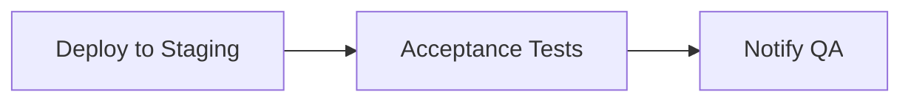
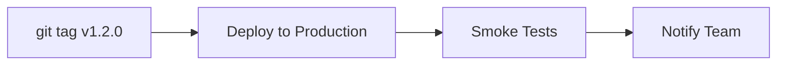

# Feature Branches & SSDLC

<span class="phase-badge downstream">🟢 Downstream</span>

## Why Branching Strategy Matters

A branching strategy is the team's agreement on **how code flows from a developer's mind to production**. Without a strategy, you get merge conflicts, broken builds, untested deployments, and the dreaded "it works on my machine." With a good strategy, every change is traceable, reviewable, testable, and reversible.

UDOO's branching model is designed for Kanban flow: feature branches are short-lived (1–3 days), PRs are small and reviewable, and the path to production is automated and gated.

---

## The Branching Model

We do **not** use Git Flow. There is a single long-lived branch: **main** (or **master**). All work is done on short-lived feature branches that branch from main and merge back to main. Releases are marked with tags.



| Branch | Purpose | Lifetime | Merges To |
|--------|---------|----------|-----------|
| **main** | Production-ready code. Every commit on main is deployable. Releases are marked by tagging main. | Permanent | — |
| **feature/*** | Per-story implementation branch. Created from main, merged back to main via PR. | 1–5 days (target: 1–3) | main |
| **bugfix/*** | Bug fix branch. Same lifecycle as feature but for defect remediation. | 1–3 days | main |
| **hotfix/*** | Emergency production fix. Created from main when production is broken and must be fixed immediately. | Hours | main |

::: warning Hotfix ≠ Bugfix
A **hotfix** is created from main and merged back to main — it follows the same PR and review process but is prioritised for immediate merge and deployment because production is broken. A **bugfix** is a normal fix that goes through the standard flow. Using hotfix for non-emergencies trains the team to bypass quality gates. Reserve hotfix for genuine P0 incidents.
:::

---

## Branch Naming Convention

Branch names are not decoration — they are **traceability links** between code and the story it implements.

### Format

```
{type}/{ticket-id}-{short-description}
```

### Examples

| Type | Ticket | Branch Name |
|------|--------|-------------|
| Feature | MOM-234 | `feature/MOM-234-save-reflection` |
| Feature | SFC-42 | `feature/SFC-42-matching-algorithm` |
| Bugfix | OPS-991 | `bugfix/OPS-991-jwt-policy` |
| Hotfix | INC-137 | `hotfix/INC-137-apim-rollback` |
| Feature | PH-88 | `feature/PH-88-offline-reading` |
| Feature | ANA-15 | `feature/ANA-15-bigquery-pipeline` |

### Rules

1. **Always include the Jira ticket ID.** This enables automated linking between Git, CI/CD, and Jira.
2. **Use lowercase and hyphens.** No spaces, no underscores, no camelCase.
3. **Keep the description short** (2–4 words). The ticket ID is the canonical reference; the description is for human readability.
4. **No personal names.** `feature/alex-new-thing` is meaningless in 6 months. `feature/SFC-42-matching-algorithm` is forever traceable.

::: tip Automated Enforcement
Add a Git hook or CI check that rejects branches not matching the naming pattern:

```bash
# .git/hooks/pre-push (simplified)
branch=$(git rev-parse --abbrev-ref HEAD)
pattern="^(feature|bugfix|hotfix)\/[A-Z]+-[0-9]+-[a-z0-9-]+$"

if [[ ! "$branch" =~ $pattern ]] && [[ "$branch" != "main" ]] && [[ "$branch" != "master" ]]; then
  echo "Branch name '$branch' does not follow convention."
  echo "Expected: {type}/{TICKET-ID}-{description}"
  exit 1
fi
```
:::

---

## Linking Branches to Jira

Traceability means every artefact links back to the story. Three connection points:

### 1. Branch Name Contains Ticket ID

```
feature/SFC-42-matching-algorithm
         ^^^^^^
         Jira ticket ID
```

Jira's Git integration (via Bitbucket, GitHub, or GitLab) automatically detects the ticket ID and shows the branch on the story's detail panel.

### 2. PR Title Contains Ticket ID

```
[SFC-42] Add matching algorithm for coffee preferences
```

### 3. Commit Messages Reference Ticket

```
SFC-42: implement preference scoring with weighted cosine similarity

- Add PreferenceVector model with normalisation
- Implement cosine similarity with configurable weight matrix
- Add unit tests for edge cases (empty preferences, identical profiles)
```

With all three links in place, a developer looking at the Jira story can see: the branch, the PR, every commit, the CI status, and the deployment. A developer looking at a commit can trace it back to the story, the epic, and the initiative. This is the "No Orphan" rule applied to code.

---

## The Feature Branch Lifecycle

Every feature branch follows the same lifecycle. Here is the Someone for Coffee matching algorithm as a concrete example.

```
Story: SFC-42 "As a user, I want to be matched with people who share
       my coffee preferences so that meetups feel natural"

┌─────────────────────────────────────────────────────────────────┐
│ 1. CREATE BRANCH                                                │
│    git checkout main                                            │
│    git pull origin main                                         │
│    git checkout -b feature/SFC-42-matching-algorithm             │
│                                                                 │
│ 2. IMPLEMENT                                                    │
│    · PreferenceVector model                                     │
│    · Cosine similarity scoring                                  │
│    · MatchingService with configurable weights                  │
│    · Vue component: MatchSuggestionCard                         │
│                                                                 │
│ 3. WRITE TESTS                                                  │
│    · Unit: scoring edge cases                                   │
│    · Component: MatchSuggestionCard renders correctly            │
│    · Integration: API returns sorted match list                 │
│                                                                 │
│ 4. SELF-TEST                                                    │
│    · Run locally, verify all AC                                 │
│    · Check edge cases: no preferences, all identical, 0 matches │
│                                                                 │
│ 5. OPEN PR                                                      │
│    · Title: "[SFC-42] Add matching algorithm"                   │
│    · Description: What / Why / How / Testing / Screenshots      │
│    · Link Jira story                                            │
│    · Assign reviewer                                            │
│    · Base branch: main                                          │
│                                                                 │
│ 6. CODE REVIEW                                                  │
│    · Reviewer checks AC coverage, edge cases, conventions       │
│    · Address feedback, push follow-up commits                   │
│    · Approved ✓                                                 │
│                                                                 │
│ 7. MERGE TO MAIN                                                │
│    · Squash merge (clean history) or merge commit                │
│    · CI runs: lint, build, test, security scan                  │
│    · Deploy to staging (or production, per pipeline config)     │
│                                                                 │
│ 8. QA IN STAGING                                                │
│    · Gherkin scenarios run against staging                      │
│    · Exploratory testing by QA                                  │
│    · Bugs found → fix on same branch or new bugfix branch        │
│                                                                 │
│ 9. RELEASE                                                      │
│    · When ready for production: deploy from main                │
│    · Tag the release: git tag v1.2.0 && git push origin v1.2.0  │
│    · Smoke test in production                                   │
│                                                                 │
│ 10. OBSERVE                                                     │
│     · Monitor error rates, usage signals                        │
│     · 48-hour stability window                                  │
└─────────────────────────────────────────────────────────────────┘
```

---

## PR Conventions

A PR is not just a code diff — it is a **communication artefact** that explains what changed, why, and how to verify it.

### Title Format

```
[{TICKET-ID}] {Imperative verb} {what changed}
```

Good:
- `[SFC-42] Add matching algorithm for coffee preferences`
- `[MOM-234] Add journal entry save flow`
- `[OPS-991] Fix JWT validation policy in APIM`

Bad:
- `matching stuff` — no ticket, no context
- `SFC-42` — no description
- `Updated the code` — meaningless

### Description Template

Every PR uses this template (enforced via `.github/PULL_REQUEST_TEMPLATE.md`):

```markdown
## What
Brief description of what this PR does.

## Why
Link to Jira story. Context on the user need or bug being fixed.

## How
Technical approach. Key design decisions. Trade-offs made.

## Testing
- [ ] Unit tests added/updated
- [ ] Component tests added/updated
- [ ] Self-tested locally (all AC verified)
- [ ] Edge cases tested: {list specific ones}

## Screenshots / Recordings
{Attach UI screenshots or screen recordings for visual changes}

## Checklist
- [ ] Branch follows naming convention
- [ ] No console.log or debug code left
- [ ] No secrets or credentials in code
- [ ] API documentation updated (if applicable)
- [ ] Observability events added (if applicable)
```

### Real Example — SFC-42 PR Description

```markdown
## What
Adds the matching algorithm that scores user compatibility based
on coffee preferences, availability windows, and location proximity.

## Why
[SFC-42](https://jira.example.com/browse/SFC-42) — Users currently
get random match suggestions. This PR introduces preference-based
scoring so matches feel more natural and users are more likely to
accept meetup invitations.

## How
- `PreferenceVector` model normalises user preferences into a
  comparable vector (time-of-day, roast preference, conversation style)
- `cosine_similarity()` scores vectors with a configurable weight
  matrix (default: availability 40%, preference 35%, location 25%)
- `MatchingService.get_suggestions(user_id, limit=5)` returns the
  top N matches sorted by score
- Frontend: `MatchSuggestionCard` displays score as a percentage
  with a visual indicator (☕ icons)

## Testing
- [x] Unit: 12 tests covering scoring edge cases
- [x] Component: MatchSuggestionCard renders all states
- [x] Self-tested: verified AC 1-5 locally
- [x] Edge cases: empty preferences (returns all users equally),
      identical profiles (score = 100%), no matches in radius

## Screenshots
[Screenshot of MatchSuggestionCard showing 87% match]
```

---

## CI/CD Pipeline Stages

Every push to a feature branch triggers the CI pipeline. Every merge to main triggers the build and (per your pipeline config) deployment to staging or production. Releases are marked by tagging main.

**On push to feature branch:**



**On merge to main:**



**On release (tag main):**



::: details Pipeline YAML Example (GitHub Actions)
```yaml
name: CI Pipeline
on:
  push:
    branches: [feature/*, bugfix/*, hotfix/*, main]
  pull_request:
    branches: [main]

jobs:
  lint:
    runs-on: ubuntu-latest
    steps:
      - uses: actions/checkout@v4
      - run: npm ci
      - run: npm run lint

  build:
    needs: lint
    runs-on: ubuntu-latest
    steps:
      - uses: actions/checkout@v4
      - run: npm ci
      - run: npm run build

  test:
    needs: build
    runs-on: ubuntu-latest
    steps:
      - uses: actions/checkout@v4
      - run: npm ci
      - run: npm run test:unit -- --coverage
      - run: npm run test:integration

  security:
    needs: build
    runs-on: ubuntu-latest
    steps:
      - uses: actions/checkout@v4
      - name: SAST scan
        uses: github/codeql-action/analyze@v3
      - name: Dependency audit
        run: npm audit --audit-level=high
      - name: Secret detection
        uses: trufflesecurity/trufflehog@v3
```
:::

---

## Security in the Pipeline (SSDLC)

The Secure Software Development Lifecycle is not a separate process — it is **embedded in the existing workflow**. Security checks happen automatically, at every stage, as part of the normal development flow.

### Shift-Left Security Model

```
TRADITIONAL: Security review happens right before release
──────────────────────────────────────────────────────────
  Dev → Dev → Dev → Dev → Dev → SECURITY → Release
                                  ↑
                              "We found 47 vulnerabilities.
                               You need to fix them all
                               before we can release."
                               (2 weeks of rework)

SHIFT-LEFT: Security is embedded throughout
──────────────────────────────────────────────────────────
  Story has    → Code uses    → PR has        → Staging
  security AC    approved       security        runs DAST
  from Upstream  dependencies   checklist       scans
  (Station 4)
```

### Security Gates by Pipeline Stage

| Stage | Security Check | Tool Category | What It Catches |
|-------|---------------|---------------|-----------------|
| **Pre-commit** | Secret detection | Pre-commit hook | API keys, passwords, tokens accidentally committed |
| **PR Build** | Static Analysis (SAST) | CodeQL, SonarQube, Semgrep | SQL injection, XSS, insecure deserialization, hardcoded secrets |
| **PR Build** | Dependency Scanning (SCA) | npm audit, Snyk, Dependabot | Known CVEs in third-party packages |
| **PR Build** | Container Scanning | Trivy, Grype | Vulnerabilities in Docker base images |
| **PR Review** | Security checklist | Human reviewer | Auth bypass, privilege escalation, data exposure |
| **Staging** | Dynamic Analysis (DAST) | OWASP ZAP, Burp Suite | Runtime vulnerabilities: injection, CSRF, misconfigurations |
| **Production** | Runtime monitoring | WAF, SIEM | Active attacks, anomalous traffic patterns |

### Security Review as a PR Checklist Item

For stories that touch authentication, authorisation, payments, or personal data, the PR template includes additional security checks:

```markdown
## Security Checklist (for auth/payments/PII stories)
- [ ] Input validation on all user-provided data
- [ ] Authentication required for all endpoints
- [ ] Authorisation checks: user can only access own data
- [ ] No sensitive data in logs (mask PII, tokens, passwords)
- [ ] Rate limiting configured for public endpoints
- [ ] CORS policy reviewed
- [ ] SQL queries use parameterised statements (no string concat)
- [ ] File uploads validated (type, size, content)
```

::: info Where Security Requirements Come From
Security requirements are not an afterthought bolted on during code review. They originate in **Upstream Station 4 (Options & Trade-offs)**, where the team identifies security constraints, runs threat modelling for high-risk features, and documents security-relevant acceptance criteria in the story. By the time the developer opens a PR, the security requirements are already in the AC. The PR checklist confirms they were implemented.
:::

---

## Merge Strategies

Different merge strategies serve different purposes. UDOO uses:

### Squash Merge — For Feature/Bugfix Branches → Main

```
BEFORE SQUASH (feature branch has 7 commits):
  c1: WIP initial scaffold
  c2: add preference model
  c3: fix typo
  c4: add scoring logic
  c5: WIP tests
  c6: fix test assertion
  c7: final cleanup

AFTER SQUASH (main gets 1 clean commit):
  "SFC-42: add matching algorithm with preference scoring (#312)"
```

**Why squash:** Feature branch commit history is messy — WIP commits, typo fixes, debugging artefacts. Squashing produces a clean, readable main history where each commit corresponds to exactly one story.

### Merge Commit — Optional for Audit Trail

Some teams prefer a merge commit instead of squash so that the PR is one merge commit on main. Either way, **main stays linear and deployable**. Choose one strategy and stick to it.

### Tag on Release

When a set of changes on main is ready for production, tag the release:

```bash
git checkout main
git pull origin main
git tag -a v1.2.0 -m "Release 1.2.0: SFC-42, MOM-234, PH-88"
git push origin v1.2.0
```

The tag is the audit trail for what was released. CI can deploy to production on tag push, or deployments can be triggered manually from tags.

---

## Code Review Best Practices

Code review is a **collaborative quality gate**, not a gatekeeping ritual.

| Practice | Good | Bad |
|----------|------|-----|
| **Response time** | Review within 4 hours of request | Leave PR unreviewed for 2 days |
| **Tone** | "This condition doesn't handle null — the API returns null for new accounts. Add a null check?" | "This is wrong. Fix it." |
| **Focus** | Behaviour, correctness, edge cases, security | Tabs vs. spaces, naming preferences (automate with linters) |
| **Scope** | Review against the story's AC | Review against your personal coding style |
| **Blocking** | Block for bugs, security issues, missing AC | Block for style preferences or "I would have done it differently" |
| **Learning** | "Interesting approach — I hadn't considered using a weighted vector here. Nice." | Radio silence (approval without engagement) |

::: warning The Review Bottleneck
Code review is the most common bottleneck in Downstream flow. When reviews take too long, WIP accumulates in In Review, developers context-switch to new work, and cycle time balloons. Mitigations:

1. **Pair programming** — code is reviewed as it is written. PR review becomes a formality.
2. **Review rotation** — assign a "review buddy" for each developer. Their first task each morning is checking for open PRs.
3. **Small PRs** — a 100-line PR takes 15 minutes to review. A 1000-line PR takes 2 hours and gets superficial attention.
4. **WIP limits on In Review** — when the column is full, someone must review before anyone starts new work.
:::

---

## Anti-Pattern: The Long-Lived Feature Branch

A feature branch that lives for more than 5 days is a ticking time bomb.

### What Happens

| Day | Developer's Experience | Team's Experience |
|:---:|----------------------|-------------------|
| 1–2 | "Making good progress. Branch is clean." | Nothing unusual. |
| 3–5 | "Main has changed a lot. I'll merge later." | Other stories are merging to main. The gap widens. |
| 5–8 | "I tried to merge main into my branch. 14 conflicts." | Stories depending on this branch are blocked. |
| 8–12 | "I'm spending more time resolving conflicts than building features." | Team throughput drops. Planning horizon is unreliable. |
| 12+ | "I'm afraid to merge. What if I break something?" | The branch becomes a parallel codebase. Integration is a project unto itself. |

### The Root Causes

| Cause | Fix |
|-------|-----|
| Story too large | Slice the story into smaller deliverable increments |
| Developer perfectionism | Ship working code, iterate. Perfect is the enemy of done. |
| No WIP limit | Enforce: if you haven't merged in 3 days, something is wrong |
| Waiting for review | Review within 4 hours. If no one reviews, escalate in standup. |
| Uncertain requirements | Story was not Ready. Send it back to Upstream. |

### The Rule

> **If a feature branch has not been merged within 5 working days, it requires a team discussion in the next standup.** The discussion must result in one of: (a) a plan to merge within 24 hours, (b) breaking the branch into smaller PRs, or (c) abandoning the branch and re-slicing the story.

::: danger The Merge Nightmare
The Someone for Coffee matching algorithm was originally attempted as a single 2-week feature branch. By Day 8, main had moved forward with 23 commits from other stories. The merge produced 31 conflicts across 12 files. It took 2 full days to resolve — and the resolution introduced a regression in the chat module. The story was re-sliced into three smaller branches (scoring model → API endpoint → frontend component), each merged within 2 days. Total time: less than the conflict resolution alone. **Small branches are faster than big branches, even when they seem like more work.**
:::

---

## Quick Reference

| Concept | Rule |
|---------|------|
| Branching model | main only (or master). Branch from main, merge back to main. Tag on release. |
| Branch naming | `{type}/{TICKET-ID}-{description}` — always include the Jira ticket ID |
| PR target | main |
| Merge strategy | Squash (or merge commit) to main |
| Release | Tag main: `git tag v1.2.0` |
| Review SLA | Within 4 hours |
| Branch lifetime | Target 1–3 days, max 5 days before escalation |
| Security gates | SAST + SCA + secret detection on every PR; DAST in staging |
| CI/CD | Lint → Build → Unit → Integration → Security → Deploy on merge to main |
| Anti-pattern | Long-lived feature branches (5+ days without merge) |

---

[← Kanban Flow](/downstream/kanban-flow) · [Release Slicing →](/downstream/release-slicing)
