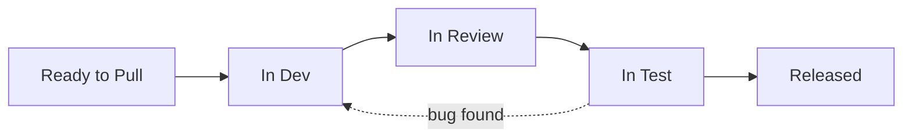

# Kanban Flow

<span class="phase-badge downstream">🟢 Downstream</span>

## The Moment This Page Is For

Monday morning. Sprint starts. Five developers each pick two stories. Ten things are "In Progress" by noon.

By Wednesday, one developer is blocked waiting for a backend endpoint. Another is in review — but the reviewer hasn't looked because they're deep in their own work. A third just found an edge case that doubles the scope. Nothing is close to done.

By Friday, the team has nine stories "In Progress" and zero Released. At the sprint review, they explain why the most important thing isn't ready. Again.

The problem is not the developers. The problem is a system with no flow control. Work entered freely. Nothing exited. The board became a parking lot.

This page is about how to build a system where things actually finish.

---

## The Core Insight: Different Phases, Different Methods

UDOO uses **discovery sprints for Upstream** and **Kanban for Downstream**. This is not an accident, and it is not a compromise. It is a deliberate design decision rooted in the nature of the work.

Upstream is **discovery** — time-boxed exploration of an uncertain problem space. Fixed-length discovery sprints create urgency, force prioritisation, and produce a measurable output (Ready stories). Discovery without a time-box expands indefinitely.

Downstream is **delivery** — continuous execution of work that has already been shaped. Stories arrive meeting the Definition of Ready. The team's job is to flow them through the system as efficiently as possible: implement, review, test, release. There is no sprint boundary to wait for. When a developer finishes a story, they pull the next one.

### Releases anchor planning; iterations anchor cadence

In Downstream, planning is **release-anchored**, not sprint-anchored. A **release** corresponds to a Slice (S1, S2, S3) — it was defined in Initiative Discovery and represents a coherent unit of user value. Stories in that release flow through the Kanban board continuously until all of them are done.

The **iteration** (typically 2 weeks) provides the ceremonial rhythm — demo, retro, flow review — but it does not gate releases. A release ships when all its stories pass the Definition of Done. That might happen mid-iteration, or it might span two iterations. The calendar does not control the release; the quality gate does.

```
Release (S1)  ←  what we're working toward  ←  defined in Initiative Discovery
Iteration     ←  how we review and improve  ←  every 2 weeks, regardless of release state
```

This separation is what allows Downstream to be truly continuous while remaining planned and measurable.



::: info Why Not Scrum for Both?
Scrum's sprint boundary creates an artificial batch: stories pile up until sprint planning, get committed in bulk, and race toward a sprint deadline. This works for discovery (where the batch is "how many stories can we make Ready in 2 weeks") but fights against delivery flow. In Downstream, a story that is Ready on Tuesday should not wait until next Monday's sprint planning to enter development. Kanban lets work flow continuously, which is exactly what execution requires.
:::

---

## The Six Kanban Principles

Kanban is not "Scrum without sprints." It is a distinct method with its own principles, all of which UDOO applies to Downstream.

### 1. Visualise the Work

Every story is visible on the Kanban board. Every state transition is explicit. No work happens in someone's head, in a private branch, or in a Slack DM. If it is not on the board, it does not exist.

### 2. Limit Work in Progress (WIP)

The most important and most resisted principle. WIP limits cap how many stories can be in each column simultaneously. They prevent the team from starting everything and finishing nothing.

### 3. Manage Flow

The team optimises for **flow** — the smooth, predictable movement of stories from Ready to Pull through to Released. Flow is measured, visualised, and continuously improved.

### 4. Make Policies Explicit

Entry criteria, exit criteria, review standards, and escalation paths are documented and visible. No one should have to ask "when is a story ready to move to the next column?"

### 5. Implement Feedback Loops

Standups, demos, retrospectives, and flow metrics reviews are all feedback loops. They surface problems early and drive continuous improvement.

### 6. Improve Collaboratively, Evolve Experimentally

The team owns the process. Improvements are proposed in retrospectives, tested for 2–4 weeks, and evaluated with data. No one imposes process changes from outside the team.

---

## WIP Limits by Column

WIP limits are the engine of Kanban. Without them, you have a task board, not a Kanban system.

| Column | WIP Limit | Rationale |
|--------|:---------:|-----------|
| **Ready to Pull** | Unlimited | Upstream fills this column. It is the team's inventory of shaped work. No limit needed — the constraint is Upstream's throughput. |
| **In Dev** | 2–3 per team | Forces developers to finish work before starting new work. A 4-person team with a WIP of 2 means at most 2 stories are being implemented at once — the other developers are pairing, reviewing, or helping unblock. |
| **In Review** | 2 | If more than 2 stories are waiting for review, the team has a review bottleneck. Someone should stop starting and start reviewing. |
| **In Test** | 3 | QA can typically handle 2–3 stories in various stages of testing. Beyond 3, quality drops as context-switching increases. |
| **Released** | No limit | Released work is done. It flows through to Observed naturally. |
| **Observed** | No limit | Stories remain here during the 48-hour stability window. |

::: warning When WIP Limits Feel Painful
WIP limits are supposed to feel uncomfortable. When a developer finishes a story and cannot pull a new one because In Dev is at capacity, that discomfort is the system telling you something: there is a bottleneck downstream. The correct response is not "raise the WIP limit." It is "go help unblock the bottleneck." Review a PR. Pair with the developer who is stuck. Help QA reproduce a bug. **Stop starting, start finishing.**
:::

### Adjusting WIP Limits

WIP limits are not permanent. The team experiments:

| Situation | Adjustment | Expected Effect |
|-----------|-----------|-----------------|
| Stories consistently wait in In Review for 4+ hours | Lower In Dev WIP by 1 | Forces developers to review before pulling new work |
| QA is idle because nothing reaches In Test | Raise In Dev WIP by 1 (temporarily) | Pushes more work toward QA |
| Everything flows smoothly | Keep current limits | Don't fix what isn't broken |
| Team grows by 1 developer | Raise In Dev WIP by 1 | Match capacity to headcount |

::: tip Start Tight, Loosen Gradually
New teams should start with the lowest reasonable WIP limits (In Dev = 2, In Review = 1, In Test = 2). This will feel slow — and that slowness will expose every bottleneck in the system. Once the team has identified and addressed those bottlenecks, gradually raise limits. A team that starts with high WIP limits never discovers their flow problems.
:::

---

## Why WIP Limits Work: Little's Law

Little's Law is the mathematical foundation of Kanban:

```
Lead Time = WIP ÷ Throughput
```

| Variable | Definition | Example |
|----------|-----------|---------|
| **Lead Time** | Time from Ready to Pull → Released | 5 days |
| **WIP** | Number of stories currently in the system (In Dev + In Review + In Test) | 5 stories |
| **Throughput** | Stories completed per unit time | 1 story/day |

The equation reveals the fundamental insight: **if throughput is constant, the only way to reduce lead time is to reduce WIP.**

### The Highway Metaphor

Think of a motorway at rush hour. Adding more cars (higher WIP) does not make traffic faster — it makes it slower. Every car spends more time on the road. The highway's throughput (cars exiting per hour) is actually highest at moderate traffic density.

Your Kanban board works the same way:

```
LOW WIP (2–3 stories in flight)
─────────────────────────────────
🚗 _____ 🚗 _____ 🚗 _____
Flow is smooth. Each story moves quickly.
Lead time: 3 days.

HIGH WIP (8–10 stories in flight)
─────────────────────────────────
🚗🚗🚗🚗🚗🚗🚗🚗🚗🚗
Everything is stuck. Context switching kills focus.
Lead time: 12 days.
```

Both scenarios have the same team, the same skills, the same number of working hours. The only difference is WIP. Lower WIP = faster flow = shorter lead time.

---

## Flow Metrics

You cannot improve what you do not measure. Downstream tracks three flow metrics continuously.

### Cycle Time

**Definition:** The time from when a story enters **In Dev** to when it reaches **Released**.

**What it tells you:** How long the team's execution process takes, independent of queue time.

**Target:** 3–5 days for a standard story. Stories consistently exceeding 5 days indicate a process bottleneck or stories that are too large.

```
CYCLE TIME CALCULATION
──────────────────────
Story MOM-234 "Save a reflection"
  In Dev:     Mon 09:00
  In Review:  Tue 14:00  (1.2 days in dev)
  In Test:    Wed 10:00  (0.8 days in review)
  Released:   Thu 15:00  (1.2 days in test)
  ──────────────────────
  Cycle Time: 3.25 days
```

### Lead Time

**Definition:** The time from when a story enters **Ready to Pull** to when it reaches **Released**.

**What it tells you:** The total time from the team's perspective — including queue time waiting to be pulled. Lead time includes cycle time plus wait time.

**Target:** 5–8 days. If lead time is significantly longer than cycle time, stories are sitting in Ready to Pull too long (either too much inventory or too little capacity).

### Throughput

**Definition:** The number of stories completed (reaching Released) per week.

**What it tells you:** The team's delivery rate. Unlike velocity (story points), throughput counts stories — which is more stable and less gameable.

**Target:** Varies by team size. A 4-developer team typically delivers 3–5 stories per week. Track the trend, not the absolute number.

::: details How to Track These Metrics
Most Kanban tools (Jira, Linear, Azure DevOps) calculate these automatically from state transitions. If you are using a physical board:

1. **Stamp dates** on each story card when it enters a new column
2. **Record completions** in a simple spreadsheet: Story ID, Date Entered In Dev, Date Released
3. **Calculate weekly:** Average Cycle Time, Average Lead Time, Stories Released This Week
4. **Plot a trend line** over 8–12 weeks to see if flow is improving

Review metrics in the bi-weekly Iteration Planning ceremony. Don't obsess over individual data points — look for trends and patterns.
:::

---

## Cumulative Flow Diagram (CFD)

The CFD is the single most powerful visualisation in Kanban. It shows the total number of stories in each state over time, stacked as coloured bands.

```
Stories
  ^
  |         ┌─────────── Released (green)
  |        /│
  |       / │  ┌──────── In Test (yellow)
  |      /  │ /│
  |     /   │/ │ ┌────── In Review (orange)
  |    /    /  │/│
  |   /    /│  / │ ┌──── In Dev (blue)
  |  /    / │ /  │/│
  | /    /  │/   / │ ┌── Ready to Pull (grey)
  |/    /   /   /  │/│
  └───/───/───/───/──┴── Time →
      W1  W2  W3  W4
```

### How to Read a CFD

| Pattern | What It Means | Action |
|---------|--------------|--------|
| **Bands are roughly parallel** | Healthy flow. Work enters and exits at a consistent rate. | Keep doing what you are doing. |
| **A band is expanding** | WIP is accumulating in that state — a bottleneck. | Investigate why work is stuck. Add capacity or reduce incoming flow. |
| **A band is flat (horizontal)** | No work is entering or leaving that state. Work is blocked. | Escalate immediately. Something is preventing progress. |
| **The gap between Ready to Pull and Released is widening** | Lead time is increasing. The team is falling behind. | Reduce WIP. Focus on finishing over starting. |
| **Ready to Pull band is shrinking** | The team is consuming inventory faster than Upstream is filling it. | Signal Upstream to prepare more stories. This is a good problem. |

::: warning The "Everything In Dev" Anti-Pattern
When the In Dev band dominates the CFD — wide and growing — while In Review and In Test bands are thin, the team is starting too much and finishing too little. This is the most common CFD pattern in teams without WIP limits. The fix: enforce WIP limits aggressively and make reviewing/testing a team responsibility, not just the QA engineer's job.
:::

---

## The Pull System

In Kanban, work is **pulled**, not pushed. No one assigns stories to developers. Developers choose what to work on based on priority and capacity.

### How Pulling Works

1. A developer finishes their current story (it moves to In Review or beyond)
2. They check the **In Dev** column — is it below the WIP limit?
3. If yes, they go to **Ready to Pull** and select the highest-priority story
4. They move it to In Dev, assign themselves, and begin work
5. If In Dev is at the WIP limit, they help unblock work in later columns

### Priority Rules for Pulling

| Priority | Rule |
|:--------:|------|
| 1 | **Expedite items** (P0 bugs, production incidents) — always pull first |
| 2 | **Blocked stories** that became unblocked — resume before starting new work |
| 3 | **Oldest story in Ready to Pull** — first in, first out reduces lead time |
| 4 | **PM-flagged priority** — stories the PM has explicitly marked as high-priority for this iteration |
| 5 | **Developer's choice** — all else being equal, pick based on skill fit and learning goals |

::: tip Why Pull Beats Push
In a push system, a manager assigns stories to developers at the start of a sprint. This creates several problems: the manager may not know each developer's current load, assignments create ownership silos ("that's not my story"), and developers feel less autonomy. In a pull system, developers self-organise. They see the whole board, understand priorities, and make informed decisions. This builds ownership, reduces management overhead, and surfaces capacity problems naturally.
:::

---

## Handling Blocked Work

A blocked story is a flow killer. One blocked story can cascade into multiple idle developers, missed releases, and compounding delays.

### The 4-Hour Escalation Rule

| Time Blocked | Action | Owner |
|:------------:|--------|-------|
| 0–1 hours | Developer attempts to self-resolve (check docs, ask in team channel) | Developer |
| 1–4 hours | Developer posts in #blockers channel with story ID, blocker description, and what they have tried | Developer |
| 4+ hours | Kanban Facilitator escalates to Tech Lead. If external dependency, escalate to PM. | Kanban Facilitator |
| 8+ hours | Blocker is discussed in the next standup as the first item. Alternative approaches considered. | Tech Lead |
| 24+ hours | Story is moved to a "Blocked" swim lane. Team reassesses whether to work around it or wait. | Team |

### Blocker Clustering Analysis

At each retrospective, review the blockers from the past 2 weeks:

```
BLOCKER ANALYSIS — Iteration 2024-W38/39
─────────────────────────────────────────
Environment issues:     ████████ 4
Waiting on external:    ██████   3
Unclear requirements:   ████     2
Dependency on another:  ██       1
                        ──────────────
                        Total: 10 blockers

Pattern: 40% of blockers are environment issues.
Action: Invest in environment stability (DevOps spike).
Owner: Tech Lead. Due: Next iteration.
```

If the same category keeps appearing, it is a systemic issue — not bad luck. Address the root cause.

---

## Classes of Service

Not all work is equal. Kanban uses classes of service to differentiate how work flows through the system.

| Class | Description | WIP Treatment | Lead Time Target | Example |
|-------|------------|:-------------:|:----------------:|---------|
| **Expedite** | Production down or data loss risk. P0 bug. | Bypasses WIP limits. Only 1 expedite at a time. | < 24 hours | JWT outage causing 401 for all users |
| **Fixed Date** | External deadline — compliance, contractual, launch event | Tracked separately. Must be prioritised early enough to meet the date. | By the deadline | GDPR audit readiness by March 1 |
| **Standard** | Normal feature work flowing through the system | Subject to WIP limits | 5–8 days lead time | Save a reflection (Living Wondrously) |
| **Intangible** | Tech debt, refactoring, tooling improvements. No immediate user impact but prevents future pain. | Allocate 15–20% of throughput. Mix into the flow — do not batch. | No target — but do not defer indefinitely | Migrate from REST to GraphQL for internal APIs |

::: warning Expedite Abuse
The expedite lane exists for genuine emergencies — not for stories that a stakeholder wants done faster. If more than 10% of stories use the expedite lane, the team has a prioritisation problem, not an execution problem. Every expedite disrupts flow for the entire team. Guard the lane fiercely.
:::

### Real Example: JWT Outage as Expedite

When the JWT token validation policy was misconfigured in Azure APIM, every authenticated API call returned 401. This was a production-down event:

1. **Expedite triggered** — story created: "Rollback APIM JWT policy to last known good"
2. **WIP limits bypassed** — the senior developer dropped their current story mid-implementation
3. **Cycle time:** 2 hours from identification to production rollback
4. **Post-incident:** The dropped story was resumed. No other WIP was affected because the expedite was resolved quickly.

Had the team treated this as a standard story ("we'll get to it after the current stories"), the outage would have lasted hours instead of minutes.

---

## Board Design

### Physical vs. Digital

| Aspect | Physical Board | Digital Board (Jira, Linear) |
|--------|---------------|------------------------------|
| **Visibility** | Always visible if co-located. Drives conversation. | Accessible remotely. Required for distributed teams. |
| **Tactile feedback** | Moving a card feels satisfying. Makes flow tangible. | Drag-and-drop is functional but less visceral. |
| **Customisation** | Infinite — sticky notes, colour codes, avatars, blockers marked with red tape. | Constrained by tool features. |
| **Metrics** | Must be tracked manually. | Automated: cycle time, CFD, throughput calculated automatically. |
| **Recommendation** | Use for co-located teams as a secondary "radiator" alongside the digital board. | Use as the system of record for all teams. |

### Swim Lanes

Swim lanes add a horizontal dimension to the board. Use them sparingly:

| Swim Lane Strategy | When to Use | Example |
|-------------------|-------------|---------|
| **By Epic** | When multiple epics are in flight and you want to see progress per epic | E-LW-01 (Entry Creation), E-LW-02 (Past Entries) |
| **By Class of Service** | When expedite and fixed-date work needs clear separation | Expedite lane at top, Standard below, Intangible at bottom |
| **By Developer** | Almost never — creates ownership silos and hides WIP problems | Avoid |

### Done Policies Per Column

Each column has explicit criteria for when a story can move forward. Post these on the board header:

```
DONE POLICIES
─────────────────────────────────────────────────────────
Ready to Pull → In Dev:
  ✓ Developer assigns themselves
  ✓ Story kick-off completed (if required)
  ✓ Feature branch created from develop

In Dev → In Review:
  ✓ All AC implemented
  ✓ Unit + component tests written and green
  ✓ Self-tested in local environment
  ✓ PR opened with description template filled

In Review → In Test:
  ✓ At least 1 approval, no blocking comments
  ✓ CI pipeline green (lint, build, tests, security scan)
  ✓ Merged to develop branch

In Test → Released:
  ✓ All Gherkin scenarios green
  ✓ Exploratory testing completed
  ✓ No open P1/P2 bugs
  ✓ Design review passed (if UI change)
  ✓ PM sign-off obtained

Released → Observed:
  ✓ Deployed to production
  ✓ Smoke test passed
  ✓ Monitoring dashboard checked
```

---

## When to Use Scrum Instead

Kanban is not universally superior. There are scenarios where Scrum's structure serves Downstream better:

| Scenario | Why Scrum May Be Better |
|----------|------------------------|
| **Brand-new team** (first 2–3 months together) | Scrum's fixed ceremonies and sprint commitment provide guardrails while the team learns to work together. Kanban requires more self-discipline. |
| **Extreme uncertainty in execution** | If even after Upstream discovery the technical approach is highly uncertain, sprint boundaries provide natural checkpoints to reassess. |
| **Client-mandated sprints** | Some contracts require sprint-based reporting. Adapt the cadence rather than fight the contract. |
| **Team struggles with self-management** | If developers do not pull work voluntarily or if WIP limits are consistently ignored, Scrum's sprint commitment and defined roles provide more structure. |

::: tip The Transition Path
Many teams start with Scrum for delivery and transition to Kanban as they mature. The path: Scrum → Scrumban (Scrum ceremonies + WIP limits) → Kanban (continuous flow + cadences). Each step removes an artificial constraint as the team proves it can self-manage without it. Don't force Kanban on a team that isn't ready.
:::

---

## Anti-Pattern: "Kanban as Excuse for No Planning"

The most dangerous misunderstanding of Kanban: *"We use Kanban, so we don't plan."*

### What It Looks Like

- No iteration planning — developers just grab whatever is at the top of the backlog
- No capacity assessment — the team takes on 15 stories when they can handle 6
- No dependency mapping — two developers start related stories without coordinating
- No flow metrics — no one knows the cycle time, lead time, or throughput
- No retrospectives — "we're doing Kanban, we just flow"

### Why It Fails

Kanban without cadences is not Kanban — it is chaos with sticky notes. The six Kanban principles include "implement feedback loops" and "improve collaboratively." These require ceremonies: standups, iteration planning, demos, retrospectives, flow reviews.

### The Fix

Kanban has cadences, not sprints. The UDOO cadences for Downstream are:

| Cadence | Frequency | Purpose |
|---------|-----------|---------|
| Daily standup | Daily | Inspect flow, surface blockers |
| Iteration planning | Every 2 weeks | Set planning horizon, assess capacity |
| Story kick-off | Per story | Align dev, QA, PM before implementation |
| Demo | Every 2 weeks | Show working software, collect feedback |
| Retrospective | Every 2 weeks | Inspect and improve the process |
| Release readiness | Per release | Confirm quality gates before production |
| Flow review | Monthly | Analyse flow metrics, adjust WIP limits |

**Kanban replaces sprint commitments with WIP limits. It does not replace planning with nothing.**

::: danger The "No Planning" Team
A team that calls itself "Kanban" but has no WIP limits, no flow metrics, no retrospectives, and no iteration planning is not doing Kanban. They are doing ad-hoc development with a Jira board. This is worse than Scrum — at least Scrum forces planning every 2 weeks. If your team says "we're agile, we don't need planning," they are confusing agility with disorder.
:::

---

## Quick Reference

| Concept | Rule |
|---------|------|
| Method | Kanban for Downstream, Scrum for Upstream |
| WIP Limits | In Dev: 2–3, In Review: 2, In Test: 3 |
| Key Metric | Cycle Time (target: 3–5 days for standard stories) |
| Pull System | Developers pull work; no one assigns stories |
| Blocker Escalation | 4-hour rule: escalate if unresolved after 4 hours |
| Classes of Service | Expedite, Fixed Date, Standard, Intangible |
| CFD Review | Monthly, in the flow review meeting |
| Little's Law | Lead Time = WIP ÷ Throughput — reduce WIP to reduce lead time |
| Anti-Pattern | "Kanban without planning" — Kanban has cadences, not sprints |

---

