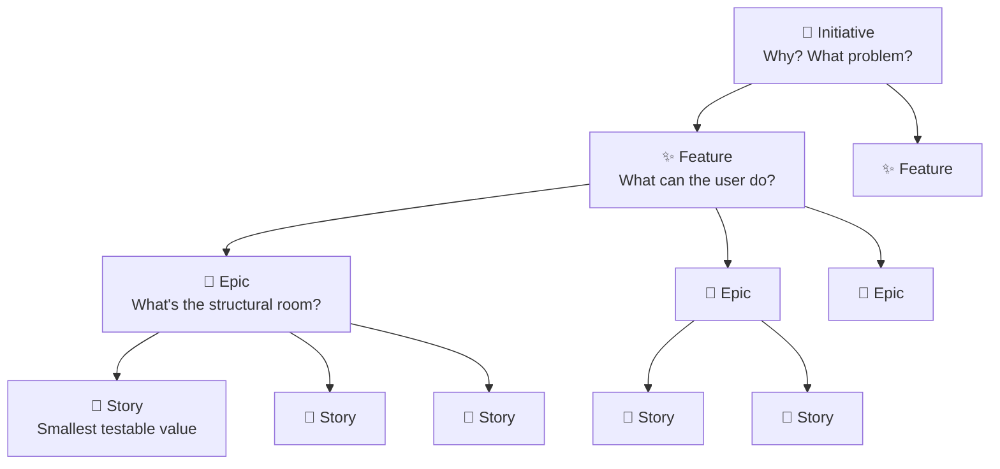

# The 4-Layer Hierarchy

All work is organised in four nested layers. Each layer answers a different question and is owned by different roles. Skipping a layer is the fastest path to downstream pain.

::: tip The upstream compass says it best
*"Skipping a layer is the fastest path to downstream pain. Respecting the layers is the fastest path to predictable delivery."*
:::

## The Decomposition Flow

Each layer clears fog for the next one. Each layer reduces the surface area for mistakes.

## The Layers

| Layer | What it answers | Owner | Lives in | Typical size |
|-------|----------------|-------|----------|-------------|
| **Initiative** | Why? What problem are we solving? | Product Manager | Confluence | 1–2 pages, ≥1 Epic |
| **Feature** | What can the user do? What experience? | Product + UX | Confluence | 3–7 Epics |
| **Epic** | What is the structural room inside the Feature? | Product + Tech Lead | Jira | 5–15 Stories |
| **Story** | What is the smallest testable unit of value? | Product + Dev + QA | Jira | Done in 1–3 days |

## Layer 1 — Initiative

An Initiative is a strategic bet. It answers **why** before answering anything else.

**A well-formed Initiative contains:**
- The audience (who has the problem)
- The problem or opportunity (what hurts or could be better)
- Why now (urgency or market context)
- Success metrics (how we know we won)
- Explicit out-of-scope (what we will not do)

**A poorly-formed Initiative contains:**
- A solution ("Build X feature")
- A technology ("Migrate to Y")
- A vague wish ("Improve performance")

::: tip Example — Good Initiative
**Initiative:** "Reduce onboarding drop-off for SMB customers"  
**Problem:** 60% of SMB trial users never complete account setup. They leave before experiencing core value.  
**Success metric:** Onboarding completion rate from 40% → 70% within 90 days of launch.  
**Out of scope:** Enterprise onboarding, billing migration, mobile onboarding (Phase 2).
:::

## Layer 2 — Feature

A Feature is a user-facing capability. It lives inside an Initiative and describes the **experience**, not the implementation. Before breaking a Feature into Epics, write an [Experience Snapshot](/upstream/experience-snapshot) — a 100-word day-in-the-life narrative that makes the Feature real for the whole team.

**Features are named from the user's perspective:**
- "User can see their real-time balance across all wallets"
- "Manager can approve team expense requests inline"

**A Feature defines:**
- The purpose and emotional outcome
- The Experience Snapshot (a real user in a real moment)
- In-scope and out-of-scope capabilities
- The high-level flow — no UI detail yet

**Features are NOT:**
- "Add balance API endpoint" (that's an Epic)
- "Refactor wallet service" (that's an Offstream Reliability Initiative)

## Layer 3 — Epic

An Epic is a cohesive **experience room** — a chunk of the Feature that maps directly to one or more user journey steps. It is the unit of delivery planning.

**Every Epic must:**
- Link to its parent Feature page in Confluence
- State which journey steps it covers (e.g., J2–J4)
- Have a clear scope boundary

## Layer 4 — Story

A Story is the **smallest testable unit of user value**. It follows the INVEST principle:

| Letter | Meaning |
|--------|---------|
| **I** | Independent — can ship on its own |
| **N** | Negotiable — scope can be adjusted |
| **V** | Valuable — delivers something real to a user |
| **E** | Estimable — team can size it |
| **S** | Small — completable in 1–3 days |
| **T** | Testable — clear pass/fail criteria |

## The Non-Negotiable Rules

  
Hierarchy Rules

  **No Epic without a linked Initiative/Feature page in Confluence.**  
  Orphan Epics cannot be prioritised, estimated, or retired intelligently.

  **No Story without a reference to at least one user journey step.**  
  Journey references connect code to user behaviour. Without them, testing is guesswork.

  **No Story larger than 3 days.**  
  Stories that take a week are Features in disguise. Split them.

## Common Violations

| What you see | What's wrong | Fix |
|---|---|---|
| Epic titled "Authentication improvements" with no Confluence link | Orphan Epic | Link to an Initiative or create one |
| Story: "As a user I want a better dashboard" | Not testable, not small | Split into specific behavioural stories |
| Initiative titled "Build reporting module" | Solution-first | Reframe as problem: "Users cannot understand their financial trends" |
| Story with 12 acceptance criteria | Too big | Split into 2–3 stories |

---

**Next:** [How to Use This Book →](/how-to-use)
