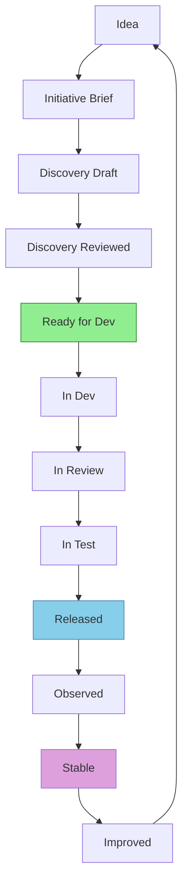
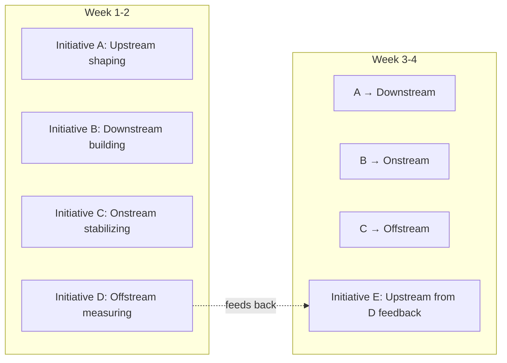

# The Lifecycle at a Glance

## The Four Phases

Every piece of work — whether a new product initiative, a bug fix, or a customer-requested feature — flows through four connected phases. These phases are not sequential in a waterfall sense. They run **in parallel across different initiatives** and feed each other continuously.

  

    🔵 <strong>Upstream</strong> 
    <small>Idea → Ready Story</small>
  

  
→

  

    🟢 <strong>Downstream</strong> 
    <small>Ready → Released</small>
  

  
→

  

    🟠 <strong>Onstream</strong> 
    <small>Released → Stable</small>
  

  
→

  

    🟣 <strong>Offstream</strong> 
    <small>Stable → Growing</small>
  

  
↩

## The Continuous Loop

The arrow at the end is the most important part of the diagram. **Offstream feeds back into Upstream.** This is what makes UDOO a lifecycle, not a pipeline.

- A support ticket pattern becomes next quarter's Initiative.
- A post-mortem finding becomes a reliability story.
- A customer health score drop triggers an urgent discovery cycle.
- An NPS theme reveals a problem no one knew existed.

Teams that treat the loop as a straight line — build, ship, move on — are destined to build features no one uses and fix incidents that keep recurring.

## Phase Summary

| Phase | Transforms | Primary Owner | Key Output | Primary Question |
|-------|-----------|---------------|------------|------------------|
| 🔵 Upstream | Idea → Ready Story | Product Manager | Initiative Brief + Ready Stories | *Are we building the right thing?* |
| 🟢 Downstream | Ready → Released | Tech Lead / Dev Team | Shipped feature + Release notes | *Are we building it right?* |
| 🟠 Onstream | Released → Stable | DevOps / SRE | Healthy service + SLO compliance | *Is it running reliably?* |
| 🟣 Offstream | Stable → Growing | Customer Success + Sales | Renewals + new Initiative signals | *Is it creating value?* |

## The Three Critical Handoff Points

### 🔵→🟢 Commitment Point

When Upstream hands a Ready Story to Downstream.

**Nothing moves until the [Definition of Ready (DoR)](/upstream/definition-of-ready) is fully met.**

Pulling a story that fails DoR is the single most common cause of mid-sprint chaos. The team inherits all the unanswered questions at maximum cost. Every hour of ambiguity that enters Downstream costs roughly five hours of rework — not because engineers are slow, but because the cost of change grows exponentially the later it is discovered.

::: warning What goes wrong when you skip the Commitment Point
A developer pulls a story titled "Improve balance display." There is no persona. No acceptance criteria. No edge case list. The developer interprets the requirement, builds what "seems right," and submits a PR. QA doesn't know what to test. The PM reviews and says "that's not what I meant." Two days of work are thrown away. This happens *every sprint* in teams without a Commitment Point.
:::

### 🟢→🟠 Delivery Point

When Downstream hands a released feature to Onstream.

**Nothing moves until the [Definition of Done (DoD)](/downstream/definition-of-done) is fully met.**

Releasing without runbooks, observability, and on-call briefing creates the conditions for a preventable incident. The Delivery Point ensures Onstream knows what changed, how to monitor it, and how to roll it back.

### 🟠→🟣 Stability Point

When Onstream confirms a feature is stable and operating within SLOs.

This is when Customer Success can confidently present the feature to customers, create enablement materials, and include it in QBRs. Promoting an unstable feature destroys customer trust faster than any competitor.

## The Lifecycle States (End to End)

**Handoff points:** Commitment Point = Ready for Dev → In Dev · Delivery Point = In Test → Released · Stability Point = Observed → Stable

## Key Artifacts Per Phase

### 🔵 Upstream Artifacts

| Artifact | Purpose | Template |
|----------|---------|----------|
| Initiative Brief | The frozen problem + scope document | [Initiative Brief](/upstream/initiative-brief) |
| Persona & JTBD | Named user with a specific job-to-be-done | [Station 1](/upstream/station-1-vision) |
| User Journey Map | Step IDs (J1…Jn) showing the user's path | [Station 3](/upstream/station-3-journey) |
| Slice Plan | S1 (MVP), S2, S3… release sequence | [Station 3](/upstream/station-3-journey) |
| Assumption Register | What we believe but haven't proven | [Station 2](/upstream/station-2-problem) |
| Architecture Decision Records | Technical choices with rationale | [Station 4](/upstream/station-4-options) |
| Success Metrics | Measurable, time-bound, owned signals | [Station 1](/upstream/station-1-vision) |

### 🟢 Downstream Artifacts

| Artifact | Purpose | Template |
|----------|---------|----------|
| Epics | Journey-coverage groupings | [Epic Template](/reference/epic-template) |
| Stories with AC | INVEST-compliant with Gherkin seeds | [Story Template](/reference/story-template) |
| Test Strategy | Gherkin scenarios + manual test plan | [Gherkin Patterns](/downstream/gherkin) |
| Release Notes | What changed and why | [Cadence](/downstream/cadence) |
| Observability Updates | Dashboards, alerts, log queries | [Delivery Point](#-delivery-point) |

### 🟠 Onstream Artifacts

| Artifact | Purpose | Template |
|----------|---------|----------|
| Runbook | Per-service operational guide | [Runbook Template](/onstream/runbook-template) |
| SLO Dashboard | Real-time reliability visibility | [SLA & SLO](/onstream/sla-slo) |
| Incident Report | What happened, timeline, impact | [Incident Management](/onstream/incident-management) |
| Post-Mortem | Blameless review with action items | [Post-Mortem Template](/onstream/post-mortem-template) |
| RCA | Structured root cause analysis | [RCA Template](/onstream/rca-template) |

### 🟣 Offstream Artifacts

| Artifact | Purpose | Template |
|----------|---------|----------|
| Customer Health Score | Red/Amber/Green per account | [Health Score](/offstream/health-score) |
| QBR Deck | Quarterly business review materials | [Account Cadence](/offstream/account-cadence) |
| Renewal Plan | Proactive retention strategy | [Customer Lifecycle](/offstream/customer-lifecycle) |
| CS Feedback Issues | Jira issues linking customer signals to Upstream | [Feedback Loop](/offstream/feedback-loop) |
| NPS/CSAT Analysis | Quantified customer sentiment trends | [Feedback Loop](/offstream/feedback-loop) |

## How Phases Run in Parallel

In a healthy team, all four phases are active simultaneously — but on *different* initiatives:

This is the steady-state rhythm. New initiatives are always being shaped. Work is always being built. Services are always being operated. Customer signals are always being collected. The loop never stops.

::: tip The RACI Principle Across Phases
**Accountable** by phase, **Collaborative** across phases. While each role takes ownership in their primary phase, cross-functional involvement ensures smooth transitions. A Tech Lead sits in Upstream architecture sessions. A PM observes Downstream demos. A Support Lead reviews post-mortems. No phase operates in isolation.
:::
