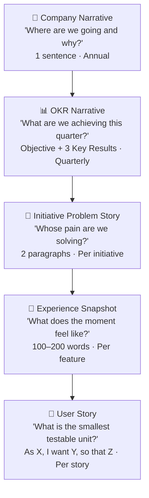
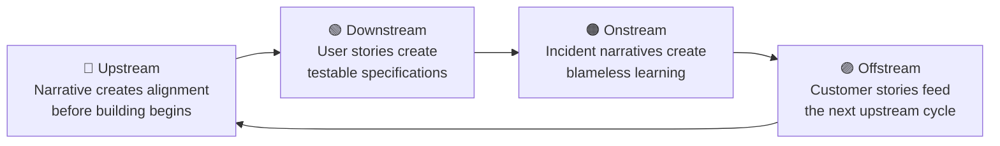
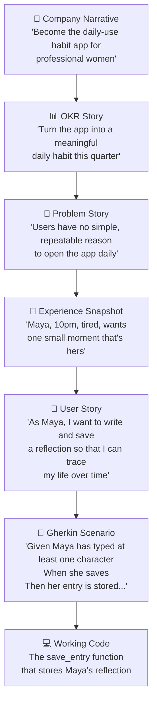

# The Narrative Framework

## Why Storytelling Is the Core Skill of Product Development

There is a moment in every product team's history when things start going wrong — and it doesn't announce itself.

A designer finishes a beautiful mockup. A developer starts building from a ticket. A QA engineer writes test cases. A PM reports the sprint is on track. And then, two sprints later, the team demos something to a stakeholder and realises that everyone had been imagining something slightly different.

The mockup was beautiful but impractical to build. The ticket missed three key states. The test cases proved the code works but not that it's *useful*. The sprint was on track to deliver the wrong thing.

This is not a failure of intelligence or effort. It is a failure of shared mental model.

And the solution — the oldest, most human solution — is to tell a story first.

---

## The Silent Chaos That Narrative Solves

Here is what actually happens when teams work without narrative:

A product manager writes a ticket: **"Add journaling feature."**

In the developer's mind, this becomes: a text editor component, a save button, a backend endpoint.

In the designer's mind: a beautiful full-screen writing experience with typography choices.

In the QA engineer's mind: functional tests for save/load operations.

In the tech lead's mind: a new database table and API design decision.

Everyone gets to work. Everyone is productive. Everyone is building a different product.

Three sprints later, the pieces don't fit together. The designer's full-screen experience doesn't work with the developer's component structure. The backend has no concept of "daily prompts" because nobody told the developer about them. QA can't test the right things because the AC was "add journaling."

This is not edge case — it is the default outcome when teams work from task descriptions instead of narratives.

---

## What Narrative Does That Tasks Cannot

A narrative creates a **shared mental model**.

When you say *"Maya comes home at 10pm, tired, and wants one small moment that belongs entirely to her — she opens the app, reads a quiet prompt, writes three sentences, and goes to sleep feeling slightly more herself"* — every person on the team imagines roughly the same thing.

They imagine a quiet, minimal experience. They imagine a forgiving text input (no character limits that feel punishing). They imagine a subtle confirmation, not a confetti explosion. They imagine offline support, because people journal at night before sleep, not necessarily on fast wifi.

Nobody told them these things explicitly. The story told them.

This is the transformative power of narrative in product development: **a good story makes a hundred design decisions before anyone opens a design tool or writes a line of code.**

---

## The Five Levels of Narrative in U.D.O.O

The framework uses narrative at every layer. Each layer uses a different type of story, at a different scale, for a different purpose.



Each level narrows the scope and increases the specificity. Each level makes the next level easier to write. And each level serves a distinct communication purpose.

---

## Level 1 — The Company Narrative

**What it is:** A one-sentence statement of where the company is going and why it matters.

**Why it matters:** Every initiative, feature, and story should be traceable back to this sentence. When someone on the team can't remember why they're building something, they should be able to trace it here.

**Format:** *"We will [direction] so that [business outcome]."*

**The test:** Can a new hire read this sentence and immediately understand what the company values?

| ❌ Not a narrative | ✅ A real narrative |
|---|---|
| "Be the best app in our category" | "Become the daily-use habit app for professional women who want to bring more intention to their lives" |
| "Grow revenue" | "Become the trusted operational backbone for independent service businesses, replacing spreadsheets with calm clarity" |
| "Innovate with AI" | "Use AI to make the complexity of Jewish learning accessible to people who thought it wasn't for them" |

Notice what changes: the narrative version has a **person** in it. It names who benefits and why it matters to them. A company goal without a person is a business statement. A company goal with a person is a north star.

---

## Level 2 — The OKR Narrative

**What it is:** A quarterly story of progress — an objective (what we're trying to achieve) with 3 key results (how we'll know we got there).

**Why it matters:** OKRs translate the company narrative into a measurable quarter. Without them, initiatives float free of accountability. With them, every team member knows exactly what the team is trying to move.

**The test:** Can someone reading the OKR understand not just *what* you're measuring but *why it's the right thing to measure*?

**A real example:**

> **Objective:** Turn the app into a meaningful daily habit for existing users.
>
> **Why this quarter:** Retention data shows users sign up with enthusiasm, use the app intensively for 1–2 weeks, and then disappear. We are losing people not because they dislike the product but because we haven't earned a place in their routine.
>
> **KR1:** Weekly active users: 30% → 50%
> **KR2:** Sessions per user per week: 1.2 → 3.0
> **KR3:** D30 retention: 18% → 30%

Notice the "Why this quarter" paragraph. This is the narrative layer that makes OKRs human. Without it, the numbers feel arbitrary. With it, everyone understands the story behind the numbers — and every initiative they write connects to it.

---

## Level 3 — The Initiative Problem Story

**What it is:** A 2-paragraph problem narrative that makes the user's pain undeniable.

**Why it matters:** The Initiative Problem Story is the most important narrative in the framework. It is what prevents the team from building solutions before understanding problems. It is the moment when the team commits to a *direction*, not a *feature*.

**The format:**

```
Paragraph 1: The current state — who is affected, what they experience today,
             what that costs them (emotionally, financially, in time).

Paragraph 2: The opportunity — what becomes possible if this problem is solved,
             what success looks like in measurable terms, why this is the
             right moment to address it.
```

**A poorly written Initiative Brief:**
> "We need to add a journaling feature. Users have asked for it. It will improve retention. We'll add daily prompts and a history view. Success = feature shipped."

This is a solution dressed as a problem. It tells us nothing about the user, the pain, or why this matters.

**A properly written Initiative Problem Story:**
> "Active users open the app when they receive a notification or when new content appears. Outside of those triggers, they have no reason to return. The app does not yet belong to their daily routine — it visits their life rather than living in it. Usage data confirms this: median sessions per week is 1.2, and D30 retention is 18%. These numbers reflect a product that people appreciate but haven't adopted as a habit.
>
> If we can create a simple, repeatable ritual that gives users a personally meaningful reason to open the app each day, we believe sessions per week will reach 3.0+ and D30 retention will cross 30%. The opportunity window is real: several users have written in support tickets asking for exactly this kind of daily practice feature. The signal exists; we haven't responded to it yet."

This second version creates alignment before a single design decision is made. It establishes:
- Who is affected (existing users post-onboarding)
- What the current pain costs (flat retention, low sessions)
- What success looks like (specific, measurable)
- Why now (user signals, data)

Every feature the team designs after this conversation serves *this problem*, not their own curiosity.

---

## Level 4 — The Experience Snapshot

**What it is:** A 100–200 word day-in-the-life narrative about a specific, named user in a specific moment.

**Why it matters:** The Experience Snapshot is where features get their soul. It is the bridge between the problem (level 3) and the technical work (levels 5+). It makes the design feel human before any design actually happens.

**The key insight:** When you write *"Maya comes home at 10pm..."*, you are not writing documentation. You are giving your team permission to care about a person. And people who care about a person build better software for that person.

**The full format and guide:** → [Experience Snapshot](/upstream/experience-snapshot)

**A quick example:**

> *Feature: Living Wondrously Journal*
>
> Maya is 34, works in healthcare administration, and has three children. She joined the app six weeks ago and opens it maybe twice a week when she gets a notification.
>
> Tuesday, 10:17pm. The kids are asleep. She has five minutes before she has to face the kitchen. She opens the app. There's a prompt waiting: *"What made you smile today, even briefly?"* She almost puts the phone down — but the question is small enough to answer. She types four sentences about her daughter mispronouncing spaghetti. She saves. The app responds quietly: a small star, a simple record of three entries this week. She puts the phone down. The kitchen can wait five more minutes.
>
> She didn't accomplish anything important. But she noticed something that mattered, and the app witnessed it.

What did this 150-word narrative just communicate to the team?
- The experience must be **achievable in under 3 minutes**
- The prompt must feel **inviting, not demanding** — small enough to answer when tired
- The response must be **quiet and dignified**, not celebratory
- **Missing a day shouldn't feel punishing** — three entries this week is enough
- The app should feel like it **witnesses her life**, not just stores data

None of these are in a spec document. All of them are implicit in the story. This is the power of narrative.

---

## Level 5 — The User Story

**What it is:** A single-sentence structure that captures the smallest testable unit of user value.

**The format:**
```
As [specific user or role],
I want [to perform a specific action]
so that [I can achieve a specific outcome that matters to me].
```

**Why this format exists:** Each part of the format answers a different question that prevents a different class of mistake.

| Part | Question it answers | Mistake it prevents |
|---|---|---|
| **As [user]** | Who benefits? | Building for "the system" instead of a person |
| **I want [action]** | What does the user *do*? | Writing tasks ("implement save endpoint") instead of user actions |
| **So that [outcome]** | Why does this matter? | Shipping things that work technically but deliver no value |

**The "so that" clause is the most important part.** It is also the most often omitted.

When a story has no "so that," the team cannot make design tradeoffs. When the API is slow, should they add a loading state? If the story says *"so that I can capture my daily moment of meaning"*, the answer is obvious: yes, because anything that breaks the reflective moment defeats the purpose. Without the "so that," it's just a judgment call.

### From Vague to Ready: A Story Transformation

**Step 1 — The raw task (wrong):**
> "Add journal save functionality"

This is a technical task. It has no user, no action in human terms, no outcome. The developer has to invent all three.

**Step 2 — The basic user story (better):**
> "As a user, I want to save my journal entry so that my writing is not lost."

This is better — it has a user and an outcome. But "a user" is anonymous. And "not lost" is a fear-avoidance outcome, not a value-creation outcome.

**Step 3 — The named story (good):**
> "As Maya, I want to write and save a reflection for today's prompt so that I can come back to it and trace the journey of my life over time."

Now we have a real person and a real reason. The outcome changes everything: it's not about backup, it's about a record that grows richer over time. This means the feature needs a history view from day one (not "phase 2") — because the value of saving entries is realised when you can look back at them.

**Step 4 — The shaped story with edge cases (ready):**
> "As Maya, I want to write and save a reflection for today's prompt so that I can trace the journey of my life over time."
>
> **States to handle:**
> - Empty state: prompt visible, textarea empty, Save button disabled until ≥1 character
> - Writing: textarea active, character count visible, auto-save after 3 seconds of inactivity
> - Saved: confirmation appears, star count updates, entry persists across sessions
> - Offline: entry saved locally, sync indicator visible, synced when connection restores
> - Error: saving fails, entry preserved in textarea, error message with retry option
>
> **Edge cases:**
> - Can Maya save an empty entry? No — the action requires intent
> - Can she write multiple entries in one day? Yes — but each has its own timestamp
> - What if she closes the app mid-write? Local draft preserved for 24 hours

This story is truly **Ready for Development**. Notice how the narrative (Maya's evening, her purpose) made the edge case decisions obvious. Because we know *why* she's saving, we know what the failure states need to feel like.

---

## The Natural Bridge to Gherkin

This is where the storytelling payoff becomes concrete.

Once a story is well-written with a named user and a clear "so that", the Gherkin scenarios write themselves. They are simply the story, made testable.

**The user story:**
> As Maya, I want to save my reflection so that I can trace the journey of my life over time.

**The Gherkin scenario:**

```gherkin
Feature: Journal Entry Creation

  Background:
    Given Maya is logged in
    And she has opened the Journal for today

  Scenario: Saving a reflection successfully
    Given Maya has selected today's prompt
    And she has typed at least one character in the text area
    When she taps the Save button
    Then her entry is stored with today's date and timestamp
    And when she opens the Journal tomorrow, she sees yesterday's entry in her history
    And her streak count increases by one if this is her first entry today

  Scenario: Attempting to save an empty entry
    Given Maya has not typed anything
    When she looks at the Save button
    Then the button is disabled
    And a gentle placeholder reads "Write something, even a single word"

  Scenario: Saving while offline
    Given Maya's device has no internet connection
    When she saves her entry
    Then the entry is saved locally on her device
    And a sync indicator shows "Will sync when you're back online"
    And when her connection restores, the entry syncs automatically
```

The key insight: **Maya's story is now executable**. A QA engineer can run these scenarios. An automated test suite can verify them. The team has a shared definition of "done" that comes directly from the narrative — not from a separate spec process.

This is why the framework insists: stories come from user journeys, Gherkin comes from stories, tests come from Gherkin. Each step is a natural translation of the previous one, and they all trace back to Maya at 10pm.

---

## How Narrative Enables the Entire Framework

It is not an accident that storytelling is at the center of U.D.O.O. Each phase of the framework relies on narrative in a specific way:



### Upstream — Narrative as Alignment Tool

In Upstream, the narrative serves one purpose: **getting eight people to imagine the same thing before anyone touches code**.

The Experience Snapshot, the Initiative Problem Story, and the user journey are all narrative instruments. They exist because the most expensive discoveries in product development are the ones that happen mid-sprint, when a developer realises the PM imagined something different.

A team that spends two hours writing Maya's evening story together — arguing about details, laughing at the spaghetti incident, debating whether she's a power user or a passive one — is a team that has done their design work. They have aligned without producing a pixel.

### Downstream — Narrative as Specification

In Downstream, the narrative becomes concrete. User stories with acceptance criteria, Gherkin scenarios, and edge cases are all narrative made testable. The developer builds from the story. The QA engineer tests the story. The PM reviews the story.

When a Downstream question arises (*"should the save button be disabled while offline?"*), the answer is found by returning to the narrative: *"What would feel right to Maya, tired at 10pm, on the edge of giving up on the exercise?"* The answer becomes obvious. The save button should work, and sync later. Because breaking the moment is worse than a missing sync badge.

### Onstream — Narrative as Learning

In Onstream, narrative takes the form of **incident timelines and blameless post-mortems**. These are stories about what happened — told in sequence, without protagonists or villains, focused on system behaviour rather than human blame.

The JWT outage post-mortem is a story: *"The APIM policy was deployed to production. It required an `aud` claim that legacy tokens did not carry. API requests began returning 403. For 44 minutes, customers could not access their data."*

This narrative creates learning. It is specific enough to prevent the same thing from happening again. It is blameless enough that the engineer who deployed it can contribute to the analysis without fear.

Compare this to the blame-first version: *"Dev X pushed to production without testing."* This narrative creates fear, concealment, and the same accident next quarter.

**The right narrative after an incident:** What happened, in sequence, at the system level — with curiosity about causes, not judgment about people.

### Offstream — Narrative as Signal

In Offstream, customer stories feed back into Upstream. The CS manager who hears *"we've had 140 support tickets this month about the balance showing $0.00 — users think they're broke"* is telling a story. That story has a person in it, a pain, and a measurable signal.

When that story is captured properly — in a CS Feedback issue with the persona, the pain, and the signal — it becomes the seed of the next Upstream initiative. The loop closes.

---

## The Story Workshop — How to Run It

The most valuable 90 minutes in any discovery process is a story workshop. This is where a cross-functional team builds a shared narrative together.

**Who is in the room:** PM, Designer/UX, Tech Lead, QA Lead, one developer.

**Materials needed:** A shared document (or whiteboard). Nothing else.

**The workshop flow:**

```
Phase 1 — 20 minutes: Name the person
  - Who is the primary user of this feature?
  - Give them a name. Give them a job. Give them a day.
  - What does their life look like without this feature?

Phase 2 — 30 minutes: Walk the moment
  - Choose the specific moment when they will use this feature.
  - Walk through it step by step, out loud, as a story.
  - Every time the story breaks down ("and then they... do the thing"),
    stop and clarify what "the thing" actually is.
  - Write down every uncertainty that surfaces.

Phase 3 — 20 minutes: Name the edges
  - What could go wrong in this story?
  - What happens if the user is offline? Rushed? Confused?
  - What does "bad" look like? (This becomes your error states.)

Phase 4 — 20 minutes: Write the stories
  - From the walkthrough, identify 3–5 candidate user stories.
  - For each, draft: As [name], I want [action], so that [outcome].
  - Check each story against INVEST.
```

**The test that the workshop worked:** Can every person in the room tell the story from memory, to someone who wasn't there? If yes — the team has a shared mental model. If no — keep going.

---

## The Read-It-Aloud Test

This is the single most powerful quality check for any narrative in the framework.

**Read the story aloud. Observe what happens.**

If the room nods — the story is true. People can see it.
If the room looks confused — the story has a gap.
If someone says "but what about when..." — the story has a missing branch.
If someone says "I imagined it differently" — the story is ambiguous.
If someone laughs (the good kind) — the story has a real person in it.

The read-it-aloud test works because human beings are expert story detectors. We have been telling and evaluating stories our entire lives. We notice immediately when a narrative is hollow, vague, or false — even in a product context.

Use it at every layer:
- Read the Initiative Problem Story aloud in the kickoff meeting.
- Read the Experience Snapshot aloud before the Feature design sprint begins.
- Read the user story aloud in the Three Amigos session.
- Read the Gherkin scenario aloud before the developer picks up the ticket.

If it doesn't feel real when read aloud — it is not ready.

---

## How Narrative Connects Business Goals to Working Software

This is the chain that many teams are missing. It is also the chain that, when visible, transforms a team's confidence in what they're building.



**Every story the developer writes can trace back to this chain.** Every Gherkin scenario. Every PR. Every line of code.

This is not overhead — it is orientation. It is the difference between a team that knows *why* they are building what they are building, and a team that is executing tasks without understanding their significance.

When Maya's reflection saves successfully for the first time in production — the developer who wrote that function understands, at some level, that they helped someone notice their own life.

That is what good software feels like from the inside.

---

## Don't Be Afraid

There is a fear that runs through most teams when they first encounter narrative practices.

*"I'm not a writer."*
*"This feels soft. We're engineers."*
*"We don't have time for stories — we need to ship."*

These fears are real and worth addressing directly.

**"I'm not a writer."**
You don't need to be. The Experience Snapshot is 150 words. The user story is one sentence with three clauses. The Initiative Problem Story is two paragraphs. None of these require writing talent. They require *honesty* — about who the user is, what they feel, and what they need. You already know this. You just haven't written it down.

**"This feels soft."**
The JWT outage happened because nobody wrote the sentence: *"Given a legacy token without an `aud` claim, when the new APIM policy deploys, the request fails."* That sentence would have taken 30 seconds. The outage cost 44 minutes of 100% downtime and customer trust. The "soft" story is often the hardest data point.

**"We don't have time for stories."**
You don't have time *not* to. The balance display bug — $0.00 showing instead of -$50.00 — generated 140 support tickets per month for three months before it was fixed. Three months of CS time, engineering time, and user frustration. Because no one wrote: *"As a user whose account has gone negative, I want to see my actual balance, including negative values, so that I understand what I owe."*

Every hour you invest in narrative at the beginning of a feature cycle saves multiple hours of rework, confusion, and misalignment downstream.

**The teams that adopt narrative practices consistently report:**
- Fewer mid-sprint surprises
- Faster PR reviews (the reviewer understands the purpose, not just the code)
- Better QA coverage (testers understand the user's intent)
- Stronger demos (stakeholders hear a story, not a feature list)
- Calmer onboarding (new hires understand the product through stories)
- Higher customer satisfaction (the product actually solves the right problem)

---

## A Final Note

The framework — Upstream, Downstream, Onstream, Offstream — is a structure for work. But narrative is what makes that structure feel alive.

Without narrative, the phases are boxes that work passes through.

With narrative, the phases are chapters in a story. And like every good story, each chapter makes the next one possible — and the ending, when it comes, makes sense.

Upstream discovers what Maya needs. Downstream builds it for her. Onstream keeps it running. Offstream hears her tell someone else about it.

That cycle — from discovery to value and back — is the whole framework in miniature. And it is a story worth telling well.

---

## Quick Reference

| Layer | Narrative type | Length | Written when |
|---|---|---|---|
| Company Goal | Direction statement | 1 sentence | Annually |
| OKR | Objective + "why this quarter" | 1 paragraph + 3 KRs | Quarterly |
| Initiative | Problem story | 2 paragraphs | Station 1 |
| Feature | Experience Snapshot | 100–200 words | Station 3 / Feature Sprint |
| Story | User story (As X, I want Y, so that Z) | 1 sentence | Story shaping / Three Amigos |
| Acceptance Criteria | State-by-state conditions | 3–8 bullet points | Three Amigos |
| Gherkin | Given/When/Then scenarios | 3–8 scenarios | Three Amigos |

**→ Next steps:**
- [Experience Snapshot guide →](/upstream/experience-snapshot)
- [Story Mapping →](/upstream/story-mapping)
- [Gherkin & BDD Patterns →](/downstream/gherkin)
- [The Wrong Way / Right Way tutorial →](/tutorials/wrong-way-right-way)
