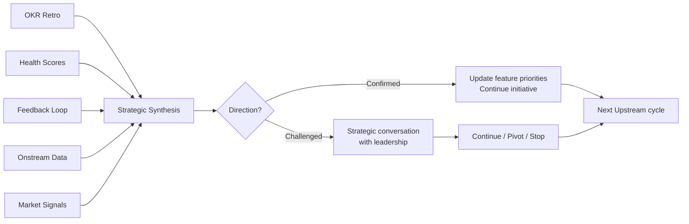

# Strategic Synthesis

<span class="phase-badge offstream">🟣 Offstream</span>

## The Moment This Page Is For

It's the last week of Q3. Noa sits in the quarterly planning meeting with three documents open.

The OKR retrospective says retention moved from 9% to 17%. Good, but below the 25% target. Two of three features shipped; one was deferred because of the P1 incident in August.

The health score dashboard shows twelve accounts in amber — up from eight at the start of the quarter. Three accounts that were green in July are amber now. Two of those are enterprise accounts with combined ARR of $420K.

The feedback loop has sixty-two CS Feedback issues logged this quarter. Thirty-one are categorized as `ux-friction`. Twenty relate to the same flow — the return experience on mobile. Four CSMs independently logged variants of the same complaint: "users who come back after a gap feel lost."

Each of these signals is valuable on its own. The OKR retro tells Noa the initiative is partially working. The health scores tell her specific accounts are degrading. The feedback loop tells her where the friction lives. But none of them answers the question that matters most: **should we keep going in this direction, or change course?**

That question requires reading across all signals at once. Not one dashboard, not one report — the full picture. The practice of doing that is strategic synthesis.

---

## What Strategic Synthesis Is

Strategic synthesis is the practice of reading accumulated signals across all sources — OKR outcomes, health scores, feedback patterns, incident data, market signals — and asking one question: **does our direction still make sense?**

It is not a meeting. It is a practice that produces a recommendation. The recommendation feeds the next quarter's strategic conversation.

Without synthesis, each signal source operates in isolation. The PM reads the OKR retro and thinks "we need to ship the third feature." The CSM reads the health scores and thinks "we need to save those amber accounts." The support lead reads the ticket patterns and thinks "we need to fix the return flow." All three are partially right. None has the full picture. Synthesis is how you get the full picture.

---

## When It Happens

Strategic synthesis runs on two triggers:

**Scheduled: quarterly.** At the end of every quarter, before the next quarter's planning begins. The synthesis feeds the planning conversation with evidence, not assumptions.

**Unscheduled: when a signal is strong enough.** A P0 incident that reveals a fundamental product assumption is wrong. A major customer churning with exit interview data that contradicts the initiative's primary persona. A competitor move that reshapes the market. These don't wait for quarter-end.

---

## The Five Inputs

Strategic synthesis reads five sources. Each source answers a different question.

### 1. OKR Retrospective Output

**Question answered:** Did the things we shipped move the numbers we care about?

The OKR retro (run at the end of each quarter) produces four things: what moved, what didn't, what we learned, and what changes. The synthesis takes the "what changes" recommendation and holds it against the other four inputs.

Noa's OKR retro says: "Continue the initiative, but the next feature should focus on the return experience specifically — the data shows that's where the 17%-to-25% gap lives." That's a recommendation. Synthesis tests whether the other signals agree.

### 2. Health Score Trends

**Question answered:** Are customers getting healthier or sicker?

Not the snapshot — the trend. Twelve accounts in amber is a data point. Eight accounts were amber at the start of the quarter and now twelve are — that's a trend. Three accounts that were green went amber — those are the ones to investigate.

If health scores are improving across the board while the OKR metric is lagging, the initiative might be working — just slowly. If health scores are declining while features ship, something is wrong that features alone won't fix.

### 3. Feedback Loop Signals

**Question answered:** What themes are emerging from customer contact?

The feedback loop has been collecting typed, categorized signals all quarter. Synthesis looks for patterns: are signals clustering around one theme? Are the same customers generating multiple signals? Is there a signal that contradicts the initiative's assumptions?

Noa sees sixty-two signals, thirty-one tagged `ux-friction`, twenty about the return experience. That's not noise — that's a pattern that independently confirms the OKR retro recommendation. When two sources agree, confidence goes up.

### 4. Onstream Data

**Question answered:** Is the product getting more or less reliable?

Incident count, mean time to resolution, error budget consumption, support ticket volume. If the team is spending more time on incidents, they have less capacity for features — and the initiative plan needs to account for that.

If the same service keeps breaking, that's not a feature priority — it's a reliability priority. The SLO framework tells you when to shift from feature work to reliability work. Synthesis reads that signal alongside the others.

### 5. Market Signals

**Question answered:** Has the world changed since we set this direction?

A competitor launched a feature that addresses the same pain differently. A regulation changed that creates new requirements. A major customer segment shifted behavior. These signals don't come from internal dashboards — they come from Sales (lost deal data), CSMs (customer conversations), and the PM's own market awareness.

Market signals are the lowest-frequency input but can have the highest impact. A single competitor move doesn't change the direction. A competitor move that three enterprise prospects cited in lost-deal interviews changes everything.

---

## The Two Outcomes

Strategic synthesis produces one of two outcomes. There is no middle ground.

### Direction Confirmed

The current initiative themes (Now / Next / Later) are still correct. The evidence supports the direction. The next quarter continues with updated feature priorities based on what was learned.

This doesn't mean "nothing changes." It means the strategic direction holds while tactics adjust. "Continue the return experience initiative, but shift from the notification feature to the re-engagement flow based on the feedback loop data" is a confirmed direction with adjusted tactics.

### Direction Challenged

The signals suggest the current direction is wrong. The primary persona is different than assumed. The problem framing missed the real friction. The market shifted. The success metric is unresponsive despite multiple shipped features.

A challenged direction triggers a conversation — not a panic. The PM presents the synthesis to leadership: here's what the signals say, here's what it implies, here's my recommendation. The team decides whether to continue, pivot, or stop.

::: warning Direction Challenged Is Not Failure
Discovering that your direction needs updating is the system working. It means the feedback loop collected real signals, the OKR retro produced honest analysis, and the synthesis practice had the courage to say "this isn't working." The failure mode is not a challenged direction — it's a direction that should have been challenged but wasn't, because nobody synthesized the signals.
:::

---

## How Strategic Synthesis Connects to the Framework

Strategic synthesis is the practice that turns Offstream into Upstream. It is the mechanism by which the framework loop actually closes.



When synthesis says "direction confirmed," the PM updates the Initiative Brief's feature map and the next Feature Discovery begins with updated priorities.

When synthesis says "direction challenged," the PM reopens Initiative Discovery — returning to Station 2 (Problem Framing) with the new evidence. The Assumption Register gets updated. The persona might change. The problem statement might change. The Feature Map is rebuilt.

Either way, synthesis produces a concrete input to the next quarter's work. Without it, the next quarter starts from the same assumptions as the last one — regardless of what the team learned.

→ [Close the Loop](/guide/close-the-loop) — the growth path page that introduces this practice
→ [The Feedback Loop](/offstream/feedback-loop) — the signal pipeline that feeds synthesis
→ [Account & Revenue Cadence](/offstream/account-cadence) — the ceremonies that generate the data

---

## The Synthesis Document

The output of strategic synthesis is a one-page document. Not a deck. Not a dashboard. A document that the PM writes and leadership reads.

### Template

```markdown
# Strategic Synthesis — Q[N] [Year]

**Author:** [PM name]
**Date:** YYYY-MM-DD
**Initiative:** [Initiative name]

## What the metrics say
[One paragraph. OKR outcomes — what moved, what didn't, by how much.]

## What customers say
[One paragraph. Health score trends + feedback loop themes.
Specific numbers: how many accounts, which direction, which themes.]

## What operations say
[One paragraph. Incident trends, error budget, reliability trajectory.]

## What the market says
[One paragraph. Competitor moves, lost deal patterns, regulation changes.
"No significant changes" is a valid answer.]

## Synthesis
[Two paragraphs maximum. What the combined signals tell you.
Where the signals agree. Where they conflict. What the implication is.]

## Recommendation
**Direction: Confirmed / Challenged**

[If confirmed:] Continue the initiative. Adjust feature priorities as follows: [specifics].

[If challenged:] Reopen initiative discovery. The evidence suggests: [what changed].
Recommend returning to Station [N] with the following new evidence: [specifics].

## Reopen triggers hit
- [ ] Success metric hasn't moved after two shipped features → [status]
- [ ] Offstream data contradicts the primary persona → [status]
- [ ] P0 incident revealed a core assumption was wrong → [status]
```

---

## Anti-Patterns

### Synthesis Without Data

"I think we should change direction" is not synthesis. Synthesis requires the five inputs — each with actual data. If the health scores haven't been maintained, the feedback loop hasn't been running, or the OKR retro was skipped, there is nothing to synthesize. The practice collapses. Fix the inputs before attempting synthesis.

### Synthesis Without a Recommendation

A synthesis that presents data without a recommendation is a report, not a practice. The PM's job is to read the signals and say what they mean. "Here are five inputs" is a report. "Based on these five inputs, I recommend we continue with adjusted priorities because..." is synthesis. The recommendation is what makes the practice actionable.

### Skipping Synthesis Because Things Seem Fine

"Things are going well, we don't need a formal review." This is how teams miss slow degradation. Three accounts moved from green to amber. That's not fine — that's a trend that's invisible without synthesis. The practice is most valuable when things seem fine, because that's when early warning signals are easiest to miss.

### Using Synthesis to Justify a Predetermined Conclusion

The PM already wants to pivot to a new initiative. They select the signals that support the pivot and ignore the ones that don't. This is not synthesis — it is confirmation bias with a document attached. The discipline is in presenting all five inputs honestly, including the ones that don't support your recommendation.

---

## Quick Reference

**When:** End of each quarter (scheduled), or when a signal is strong enough to warrant it (unscheduled).

**Who:** PM writes the synthesis document. Leadership reviews and decides.

**Inputs:** OKR retro output, health score trends, feedback loop themes, Onstream data, market signals.

**Output:** A one-page synthesis document with a recommendation: direction confirmed or direction challenged.

**Cadence:** Quarterly, as part of the planning cycle. The synthesis feeds the next quarter's initiative planning.

**Connection:** This is where Offstream becomes Upstream. The loop closes here.
