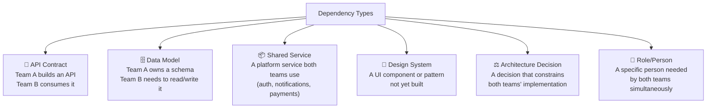
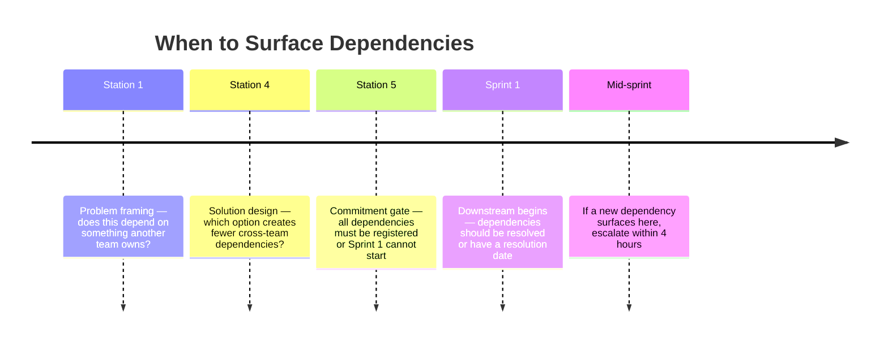
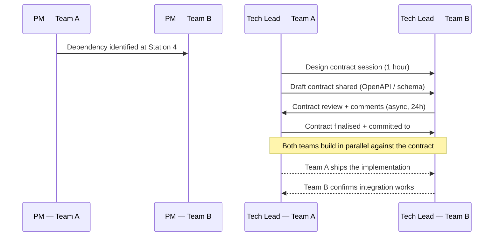

# Cross-team Dependencies

A dependency is a commitment one team makes to another.

When a team's work requires something built, decided, or delivered by another team, a dependency exists — whether it's acknowledged or not. Unacknowledged dependencies are what cause sprint crises: one team discovers mid-sprint that the API they need isn't ready, the data model isn't what they expected, or the design system component doesn't support their use case.

This page describes how to surface, register, track, and resolve cross-team dependencies before they become blockers.

---

## Dependency Types

Not all dependencies are the same. Knowing the type determines how urgently it needs to be resolved.

| Type | Example | Resolution approach |
|---|---|---|
| **API Contract** | Team B needs a `/wallets/balance` endpoint from Team A | Contract-first design — define the contract in Upstream, build in parallel |
| **Data Model** | Team B needs access to Team A's `transactions` table | Schema review in Station 4; migration plan before Downstream starts |
| **Shared Service** | Both teams need a push notification service that doesn't exist yet | Escalate to portfolio level; create a Tech Initiative for the shared service |
| **Design System** | Team B needs a `DataTable` component that doesn't exist in the system | Design system sprint or sub-task in Team A's epic |
| **Architecture Decision** | Teams A and B are making conflicting caching assumptions | Cross-team ADR review at Station 4 |
| **Role/Person** | Both teams need the same QA lead in the same sprint | Capacity planning at portfolio level |

---

## When to Surface Dependencies

The best time to surface a dependency is at **Station 4 (Solution Options)** — when options are being evaluated and architectural implications are discussed.

The earliest a dependency can be surfaced is at **Station 1** — when the problem space is first defined.

The latest a dependency should be surfaced is at the **Commitment Gate** — before Sprint 1 of Downstream. A dependency discovered after Downstream begins is a blocker, not a dependency.

---

## The Dependency Register

Every initiative in Downstream must maintain a dependency register. This is a simple table, typically in the Initiative Brief in Confluence.

**Format:**

| Dependency | Type | Blocking team | Providing team | Status | Resolution date | Owner |
|---|---|---|---|---|---|---|
| `/wallets/balance` API | API Contract | Team B (NFK) | Team A (ECW) | In design | Sprint 3 | Alex G |
| `DataTable` component | Design System | Team B | Design System team | Completed | Sprint 1 | Sarah K |
| Multi-currency schema | Data Model | Team C | Team A | Blocked — ADR pending | TBD | TBD |

**Status values:**
- **Identified** — known but not yet being addressed
- **In design** — contract or interface being defined
- **In progress** — the providing team is building it
- **Completed** — dependency resolved, consuming team unblocked
- **Blocked** — providing team has a blocker; escalation needed
- **Cancelled** — dependency no longer needed (scope changed)

---

## Dependency Resolution Protocol

### Step 1: Register the dependency at Station 4 or 5

Add it to the Initiative Brief's dependency register. Name the providing team and the consuming team. Assign an owner on each side.

### Step 2: Agree on the contract before either team builds

For API dependencies: agree on the endpoint contract (request format, response shape, error codes) before Downstream begins. Both teams work from the contract — one building it, one consuming it against a mock.

For data model dependencies: agree on the schema change in an ADR. If it's a breaking change, define the migration plan.

For design system dependencies: request the component in the design system's backlog. If it won't be ready in time, agree on a temporary local implementation with a plan to migrate.

### Step 3: Track in the cross-team dependency review

The [Portfolio's cross-team dependency review](/portfolio/#portfolio-cadence) (bi-weekly, 30 min) is the standing forum where dependency blockers are raised and resolved.

If a dependency is blocking and cannot be resolved in the dependency review, it escalates to the Portfolio Review.

### Step 4: Apply the 24-hour escalation rule

If a cross-team dependency is blocking a team's sprint and no resolution is in sight within 24 hours, escalate to:
1. Both teams' PM leads
2. The shared engineering manager (or equivalent)
3. If unresolved within another 24 hours: Portfolio Review / CTO

Do not let a cross-team blocker silently eat a sprint.

---

## Contract-First Development

For API and data model dependencies, the most effective resolution pattern is **contract-first development**.

**The rules of contract-first:**
- The contract must be agreed *before* either team builds their side
- The consuming team builds against a mock of the contract while the providing team builds the real thing
- Changes to the contract after both teams have started require a formal re-agreement (not a Slack message)
- Contract changes that break the consuming team's implementation are treated as a P1 bug by the providing team

---

## Common Dependency Failure Modes

| Failure Mode | What happens | Prevention |
|---|---|---|
| **Silent dependency** | Team B discovers at sprint review that they needed something from Team A that nobody mentioned | Station 4 dependency mapping; bi-weekly dependency review |
| **Assumed shared understanding** | Both teams think they're working on the same contract but have different interpretations | Write the contract down; don't rely on verbal agreements |
| **Late discovery** | Mid-sprint, a developer discovers a blocking dependency | DoR checklist item: "All dependencies identified and registered" |
| **Providing team deprioritises** | Team A has higher priorities than the component Team B needs | Escalate to portfolio level; make the dependency visible in the portfolio review |
| **Scope drift in the contract** | The API Team A builds is slightly different from what Team B expected | Formal contract sign-off; changes require notification + grace period |
| **Circular dependency** | Initiative A depends on Initiative B, which depends on Initiative A | Surface in Station 4; resolve by finding the natural sequencing or splitting one initiative |

---

## Multi-team Initiative Coordination

When multiple teams are working on the same initiative (e.g., a platform team + a product team), add these practices:

**Shared Initiative Brief:** One brief, co-owned. Both PM leads are named. Architecture decisions are jointly made.

**Cross-team sprint sync:** 15-minute weekly sync between the two teams' PM and Tech Lead. Agenda: blockers, contract changes, integration status.

**Shared Definition of Done:** Agree explicitly which team owns the DoD checkpoint for shared features. Usually the team that owns the user-facing layer.

**Joint demo at sprint review:** If both teams contributed to a user-facing capability, they demo it together. Users don't see team boundaries — the product should feel cohesive.
