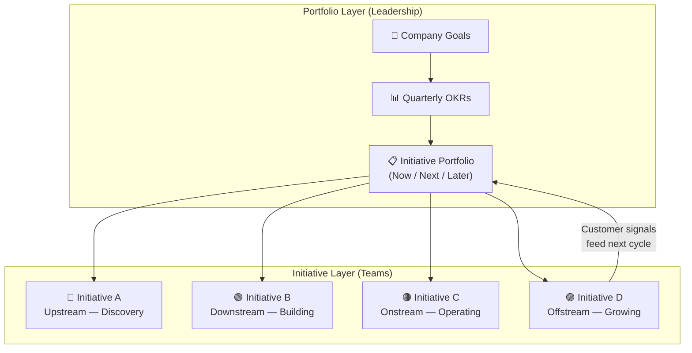
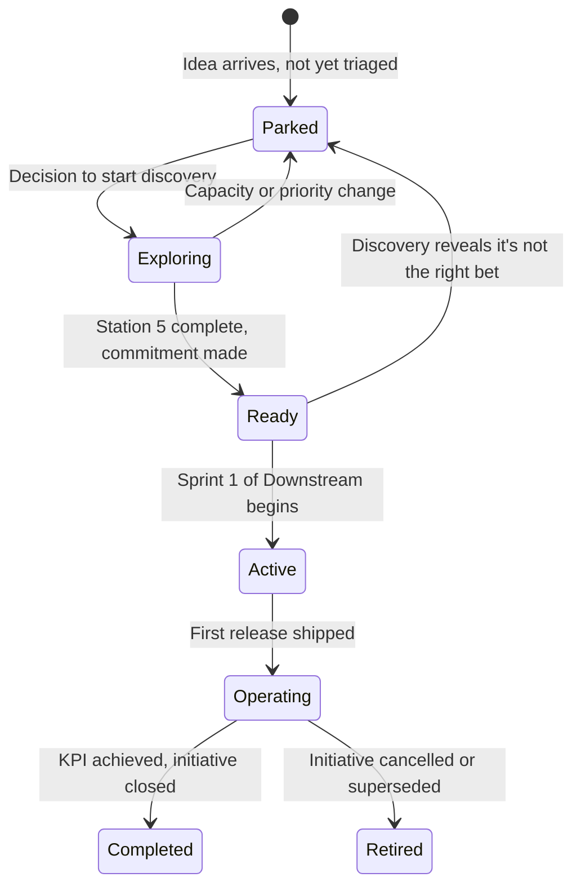
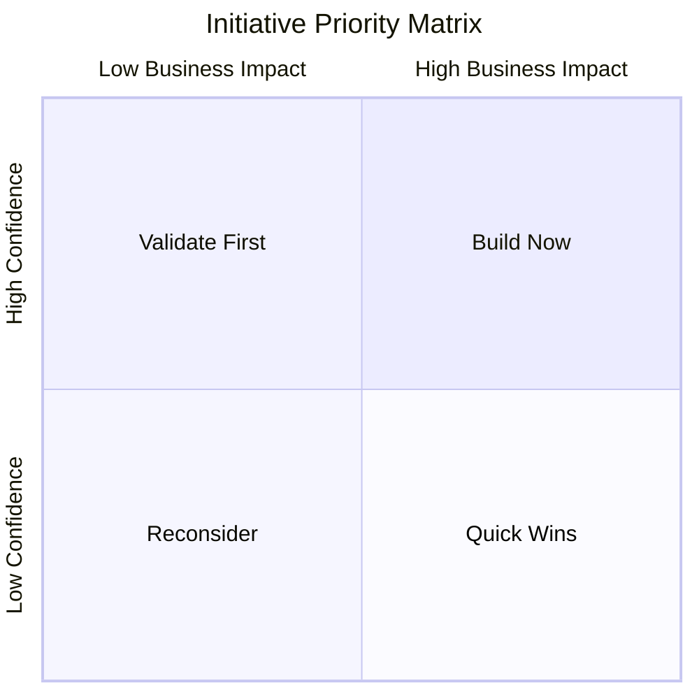
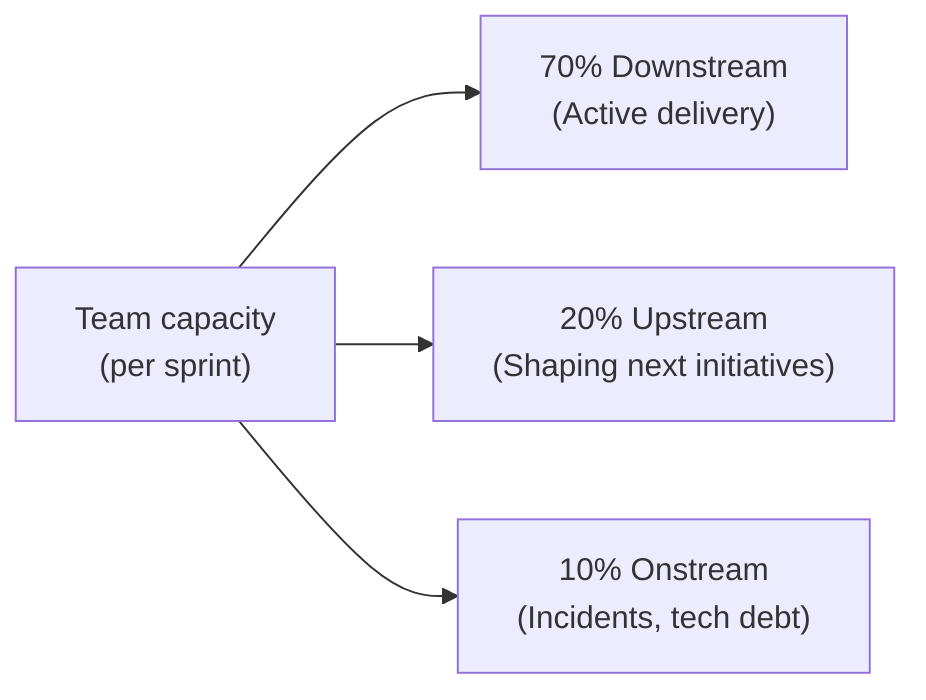

# Portfolio — Managing Multiple Initiatives

A single initiative in a single team is a product problem. Multiple initiatives across multiple teams is a portfolio problem.

The framework's four phases (Upstream → Downstream → Onstream → Offstream) describe how *one* initiative flows from idea to value. But in reality, most organisations run several initiatives simultaneously — and the skill of managing them together is different from the skill of managing any one of them well.

This section covers the portfolio layer: how to sequence, prioritise, and coordinate multiple initiatives so that each one gets what it needs without starving the others.

---

## The Portfolio Mental Model

Initiatives move through phases over time. The portfolio view shows where each initiative currently sits — and what needs attention across all of them simultaneously.

---

## The Portfolio's Three Horizons

Organise your initiative portfolio into three time horizons:

| Horizon | Time frame | What it contains | Who owns it |
|---|---|---|---|
| **Now** | Current quarter | Initiatives in Downstream (actively being built) | Product + Engineering |
| **Next** | Next quarter | Initiatives in Upstream (being shaped, ready to commit) | Product + Design |
| **Later** | Beyond next quarter | Ideas that have been triaged but not yet explored | Leadership + Product |

**The portfolio health check:**

::: tip Healthy portfolio
- Now: 1–3 active initiatives in Downstream
- Next: 2–3 initiatives in Upstream, at least one reaching Station 5
- Later: A prioritised list of 5–10 ideas, not a dumping ground
:::

::: warning Warning signs
- Now is empty (nothing in delivery) — planning failure
- Now has 6+ active initiatives — too much WIP, delivery will slow
- Next is empty (nothing being shaped) — Upstream is not running
- Later has 50+ items with no prioritisation — a backlog dumping ground, not a strategy
:::

---

## Initiative States in the Portfolio

Each initiative has a portfolio state distinct from its phase state:

---

## Portfolio Prioritisation

When multiple initiatives compete for capacity, use this framework to decide which to invest in:

### The Three Lenses

**Lens 1: Business Impact**
- Does this move a KPI tied to a current OKR?
- What is the magnitude of the impact if it succeeds?
- What is the cost of *not* doing it?

**Lens 2: Confidence**
- How well do we understand the user problem?
- How validated are our assumptions?
- How reversible is the investment if we're wrong?

**Lens 3: Capacity**
- Do we have the right people available?
- Does this create cross-team dependencies we can't manage right now?
- Is Upstream capacity available to shape it before Downstream needs it?

### The Prioritisation Matrix

| Quadrant | What to do |
|---|---|
| High impact + High confidence | **Build Now** — commit resources, start Upstream |
| High impact + Low confidence | **Validate First** — run a discovery spike before committing |
| Low impact + High confidence | **Quick Wins** — good for morale and team rhythm, time-box |
| Low impact + Low confidence | **Reconsider** — park it, don't invest discovery time |

---

## Portfolio Cadence

The portfolio needs its own rhythm — separate from sprint ceremonies:

| Ceremony | Frequency | Duration | Attendees | Purpose |
|---|---|---|---|---|
| **Portfolio Review** | Monthly | 60–90 min | Leadership + PM leads | Review Now/Next/Later; adjust priorities |
| **Initiative Retrospective** | Per initiative, at completion | 60 min | Full initiative team | What worked, what didn't, what to carry forward |
| **Cross-team Dependency Review** | Bi-weekly | 30 min | Tech Leads + PM leads | Surface and resolve cross-team blockers |
| **Capacity Planning** | Quarterly | 2 hours | Engineering managers + PM leads | Assign Upstream capacity for next quarter |

---

## The Upstream Capacity Problem

The most common portfolio failure is running Upstream and Downstream with the same people at the same time, at full capacity.

**The result:** Downstream fires never stop, Upstream never gets focus, and the "next" initiatives are never truly ready when Downstream needs them.

**The solution:** Treat Upstream capacity as a first-class resource:

This split is a guideline, not a rule. But the principle is firm: **Upstream must have protected, dedicated capacity, or it will always be crowded out by Downstream urgency.**

---

## Sections in This Chapter

- [Roadmap Planning →](/portfolio/roadmap) — How to sequence initiatives and communicate the roadmap
- [Cross-team Dependencies →](/portfolio/dependencies) — How to identify, register, and resolve dependencies between teams
