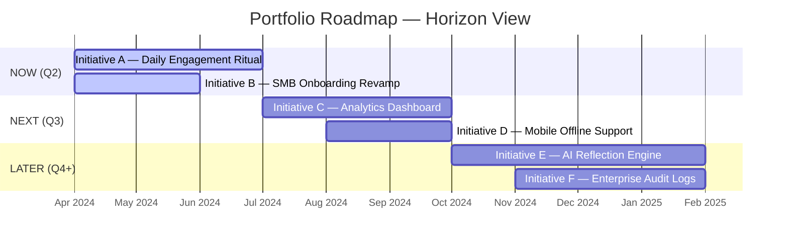

# Roadmap Planning

A roadmap is not a delivery schedule. It is not a Gantt chart. It is not a list of features with dates.

A roadmap is a **strategic narrative** — a living document that communicates where you are going, in what order, and why — with enough honesty about uncertainty to remain credible.

This page describes how to build, maintain, and communicate a roadmap rooted in the U.D.O.O framework.

---

## What a Roadmap Communicates

A good roadmap answers three questions simultaneously:

| Question | Audience | Horizon |
|---|---|---|
| **What are we solving this quarter?** | Engineering + Product | Now |
| **What are we preparing to build next?** | Stakeholders + Leadership | Next |
| **Where are we going strategically?** | Clients + Board | Later |

A roadmap that only answers the first question is a sprint board. A roadmap that only answers the third is a vision deck. A real roadmap holds all three in tension.

---

## The Now / Next / Later Model

### Now

**Definition:** Committed work. In Downstream (actively being built) or in late Upstream (Station 4–5, committed to next sprint start).

**Rules:**
- Maximum 3 simultaneous Now initiatives per team
- Each has a PM owner and a delivery owner
- Each has a primary KPI and a baseline measurement
- Scope is frozen — changes require a re-triage, not a backlog edit

**Communication:** Updated in sprint reviews; visible on the team's Jira board.

### Next

**Definition:** Prioritised and being shaped. Initiatives in Upstream (Stations 1–3), approaching commitment.

**Rules:**
- Minimum 2 items in Next at all times (to avoid Upstream starvation)
- Each must have a problem statement and a target KPI
- Not yet committed — can still be reprioritised if something more urgent surfaces
- Must reach Station 5 before moving to Now

**Communication:** Reviewed monthly in Portfolio Review; status shared in quarterly planning.

### Later

**Definition:** Triaged and directionally planned but not actively being explored.

**Rules:**
- Each item must have at least an idea triage classification (is it an Initiative? Feature? Unclear?)
- Reviewed quarterly — items that never graduate get archived
- Not a promise — clients and stakeholders must understand this horizon is directional

**Communication:** Shared in quarterly business reviews and roadmap presentations, always with the caveat that it is directional, not committed.

---

## Building the Roadmap from Scratch

### Step 1: Start with OKRs

Every roadmap starts with this quarter's OKRs. Initiatives that don't contribute to an OKR don't belong in Now or Next. They belong in Later or the parking lot.

List your OKRs. For each Key Result, identify the initiative(s) that will move it.

### Step 2: Assess current portfolio state

For each active or candidate initiative, identify:
- What phase is it in? (Upstream, Downstream, Onstream, Offstream)
- What is its primary KPI?
- Is it tracked to a current OKR?
- What are its cross-team dependencies?

### Step 3: Apply the prioritisation matrix

For initiatives not yet started, apply the [prioritisation lenses](/portfolio/#the-three-lenses) to determine which go to Now vs Next vs Later.

### Step 4: Check capacity

Count heads. Estimate Downstream capacity (70% of team per sprint). Estimate Upstream capacity (20% of team per sprint). Don't overcommit.

### Step 5: Identify dependencies and sequencing

Some initiatives must come before others. Surface these explicitly:
- "Initiative C (Analytics) requires Initiative B (Data Events) to be complete first"
- "Initiative D (Mobile Offline) requires a shared caching layer that Initiative A is also building"

Map these before committing to the roadmap. See [Cross-team Dependencies →](/portfolio/dependencies)

### Step 6: Set confidence levels

Every roadmap item should carry a confidence level:

| Level | Meaning | Horizon |
|---|---|---|
| 🟢 Committed | Scope frozen, in Downstream | Now |
| 🟡 Likely | In Upstream Station 4–5, nearly committed | Now / Next |
| 🔵 Planned | Triaged, problem validated, shaping begins next | Next |
| ⚪ Directional | Idea triaged, not yet explored | Later |

---

## Communicating the Roadmap

Different audiences need different versions of the same roadmap.

### For the Engineering team

Show: Initiative → Epic → Sprint mapping. The work breakdown. Dependencies. Blockers.

Format: Jira roadmap or sprint board view. Updated weekly.

Key messages: What are we building this sprint? What's coming next? What's blocked?

### For internal stakeholders (leadership, sales, customer success)

Show: Initiative names, problem statements, expected KPI impact, and rough timelines.

Format: Quarterly roadmap doc or slide. Updated monthly.

Key messages: What bets are we making? What will be ready to demo/sell? What's coming after?

### For clients and external stakeholders

Show: Capability-level outcomes, not features. "Users will be able to X" not "we're building Y system."

Format: Customer roadmap presentation, QBR slide, or release notes page.

Key messages: What value will you get? When? What's coming next?

::: warning Never share a feature-level roadmap with clients
Feature lists invite scope negotiations. Outcome statements (what the user will be able to do) are the right level of detail for external communication.
:::

---

## Roadmap Anti-Patterns

| Anti-Pattern | Problem | Fix |
|---|---|---|
| **The date-promise roadmap** | Every item has a delivery date, treated as a commitment | Move to Now/Next/Later — only Now items have sprint-level dates |
| **The feature laundry list** | 40 items, no prioritisation, no OKR connection | Apply prioritisation matrix; archive items that don't connect to OKRs |
| **The roadmap that never changes** | Same items sitting in "Next" for 6 months | Review and reorder monthly; if it never moves, archive it |
| **The roadmap nobody reads** | Created for quarterly planning, then ignored | Share in sprint reviews; make it the source of truth for stakeholder questions |
| **The roadmap that hides uncertainty** | All items presented as "coming in Q3" when only Now is committed | Use confidence levels; be explicit about what's directional vs committed |
| **Parallel tracks with no coordination** | Team A and Team B building things that depend on each other without a dependency map | Add a cross-team dependencies section to the roadmap |

---

## Roadmap Maintenance

A roadmap is a living document. These maintenance rituals keep it honest:

| Ritual | Frequency | Takes |
|---|---|---|
| Initiative status update | Weekly (in sprint review) | 5 minutes |
| Now/Next priority check | Monthly (in portfolio review) | 30 minutes |
| Later pruning | Quarterly | 30 minutes |
| OKR realignment | Quarterly (when new OKRs are set) | 1–2 hours |
| Full roadmap rebuild | Annually | Half-day workshop |
