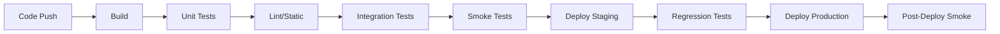

# Tooling Conventions

## The Principle: One Source of Truth per Artifact

Every artifact in UDOO has exactly one canonical location. Meeting notes live in Confluence, not in Slack threads. Bug reports live in Jira, not in email. Design files live in Figma, not on someone's desktop.

When a tool has a clear purpose and clear conventions, people stop asking "where does this go?" and start doing the work. This page defines what each tool is for, how to use it, and what to avoid.

::: tip Tools Serve the Process — Not the Other Way Around
If you find yourself bending the process to fit a tool's limitations, raise it. We change tools more easily than we change how we think about work.
:::

---

## Jira

### Why We Use It

Jira is the system of record for all work items. Every Initiative, Epic, Story, Bug, Task, and Spike lives in Jira. If it is not in Jira, it is not planned, not tracked, and not happening.

### Key Conventions

**Board Setup:**

| Board Type | Used By | Phase | Why |
|-----------|---------|-------|-----|
| **Kanban** | Downstream delivery teams | Downstream | Continuous flow; no sprint boundaries for execution work |
| **Scrum** | Upstream discovery teams | Upstream | Time-boxed sprints create urgency for discovery |
| **Kanban** | Onstream support | Onstream | Bug triage and incident response require continuous flow |

**Filter Naming:**

Filters follow the pattern: `[Team] - [Purpose] - [Qualifier]`

| Example | Purpose |
|---------|---------|
| `[Alpha] - Sprint Backlog - Current` | Current sprint items for Team Alpha |
| `[Alpha] - Bugs - Open P0/P1` | High-priority open bugs |
| `[Platform] - Epics - In Progress` | Active Epics across the platform |
| `[All] - Stale Items - 14d No Update` | Items with no update in 14 days |

**Dashboard Templates:**

Every team maintains three dashboards:

1. **Delivery Dashboard** — WIP by column, cycle time trend, throughput, ageing items.
2. **Quality Dashboard** — Open bugs by severity, bug creation vs. resolution trend, flaky test count.
3. **Discovery Dashboard** — Initiative pipeline, DoR progress, upcoming stories.

::: warning Jira Anti-Patterns
- **Updating stories in Slack instead of Jira.** If the status changed, move the card. Slack is not a status board.
- **Creating issues without required fields.** Incomplete issues pollute triage and slow the team. See [Jira Issue Type Guide](/standards/jira-issue-types) for required fields per type.
- **Ignoring stale items.** Any issue with no update in 14 days gets flagged automatically. If it is still relevant, update it. If not, close it.
- **Using sub-tasks as independent work items.** Sub-tasks belong to their parent Story. If a sub-task makes sense on its own, it should be a Task or Story.
:::

---

## Confluence

### Why We Use It

Confluence is the knowledge base. Long-form documents, decisions, and reference material that outlives a sprint or a Jira ticket lives here. Initiative Documents, architecture decisions, runbooks, meeting notes, and retrospective records all belong in Confluence.

### Space Structure

| Space | Contents | Audience |
|-------|----------|----------|
| **Product** | Initiative Documents, roadmaps, personas, journey maps | PMs, designers, stakeholders |
| **Engineering** | Architecture Decision Records (ADRs), runbooks, technical guides | Engineers, tech leads |
| **Team [Name]** | Sprint retros, meeting notes, team-specific processes | Individual team |
| **Onstream** | Incident reports, post-mortems, RCA documents | Engineering, leadership |

### Page Naming

Pages follow the pattern: `[Type] Title — Date (if applicable)`

| Example | Type |
|---------|------|
| `[Initiative] Graph Intelligence Layer` | Initiative Document |
| `[ADR] Use PostgreSQL for transaction storage` | Architecture Decision Record |
| `[Runbook] Payment gateway failover` | Operational runbook |
| `[Retro] Sprint 14 — 2025-01-15` | Retrospective notes |
| `[Meeting] Weekly sync — 2025-01-13` | Meeting notes |

### Template Usage

Confluence templates exist for:
- Initiative Documents (linked from Initiative issues in Jira)
- Architecture Decision Records
- Sprint retrospectives
- Post-mortems and RCAs
- Meeting notes

::: info Use the Template — Do Not Start from Scratch
Templates ensure consistency and completeness. Starting from a blank page means you will forget a section. Every template includes prompts for the information that experience has shown people omit.
:::

::: warning Confluence Anti-Patterns
- **Writing documentation in Google Docs.** All team documentation lives in Confluence. Google Docs is for external collaboration only.
- **Orphan pages.** Every page belongs to a space and a parent page. Floating pages are invisible and will rot.
- **Stale runbooks.** If a runbook has not been reviewed in 90 days, it is likely wrong. Every runbook has a review date and an owner.
- **Meeting notes without action items.** If the meeting produced no actions, either the meeting was unnecessary or the notes are incomplete.
:::

---

## AssertThat

### Why We Use It

AssertThat bridges the gap between Gherkin scenarios and Jira. It stores BDD scenarios, links them to Stories, tracks test execution results, and provides coverage reporting — all within the Jira ecosystem.

### Key Conventions

**Scenario Organisation:**

Scenarios are organised by Feature file, which maps to a Jira Epic or feature area.

| Feature File | Maps To |
|-------------|---------|
| `journal_entry_creation.feature` | `@feature-journal` + `@epic-entry-creation` |
| `wallet_balance.feature` | `@feature-wallet` |
| `user_login.feature` | `@feature-onboarding` |

**Jira Integration:**

- Every Gherkin scenario is linked to at least one Jira Story via AssertThat.
- Test execution results sync to the Story automatically.
- The Story's DoD includes "all linked AssertThat scenarios pass."

**Scenario Naming:**

Scenario names are descriptive and unique within their Feature file.

| Good | Bad |
|------|-----|
| `User sees updated balance after completing a transaction` | `Test balance` |
| `Login fails with expired credentials and shows error message` | `Login error` |
| `Journal entry saves when user taps Done with all required fields` | `Save works` |

::: warning AssertThat Anti-Patterns
- **Scenarios in spreadsheets.** If a scenario is not in AssertThat, it does not exist for tracking purposes. Migrate spreadsheet tests immediately.
- **Unlinking scenarios from Stories.** Every scenario must trace back to a Story. Unlinked scenarios are invisible to coverage reports.
- **Duplicating scenarios across Feature files.** Shared behaviour goes in a Background or a shared step definition, not a copy-pasted Scenario.
:::

---

## Figma

### Why We Use It

Figma is the single source of truth for design. All UI/UX design work — wireframes, mockups, prototypes, component libraries, and design system documentation — lives in Figma. Developers reference Figma for implementation; QA references Figma for visual verification.

### Key Conventions

**File Naming:**

Files follow the pattern: `[Project] Feature — Version`

| Example |
|---------|
| `[UDOO] Journal Entry Flow — v2.1` |
| `[UDOO] Wallet Dashboard — v1.0` |
| `[UDOO] Design System — Components` |

**Version Control:**

- Major design changes create a new version (v1 → v2), not an overwrite.
- In-progress explorations are kept in a "Drafts" page within the file.
- Approved designs are moved to the "Final" page and linked from the Jira Story.

**Design Review Process:**

1. Designer shares the Figma link in the Story description.
2. Reviewers leave comments directly in Figma (not in Slack, not in Jira comments).
3. Designer resolves comments and marks the design as "Ready for Dev."
4. Developer references the Figma link during implementation.

**Handoff:**

- Use Figma's Dev Mode for spacing, colours, and typography specs.
- Export assets directly from Figma — do not screenshot and crop.
- If a design token (colour, spacing, font size) is not in the design system, add it before using it. One-off values create inconsistency.

::: warning Figma Anti-Patterns
- **Designing in code without a Figma reference.** Even quick UI changes need a Figma mockup, even if it is rough. "I'll match it by eye" leads to inconsistency.
- **Sharing screenshots instead of Figma links.** Screenshots go stale immediately. Links always show the current state.
- **Skipping the design system.** If a component does not exist in the design system, create it — do not build a one-off.
:::

---

## Git

### Why We Use It

Git is the version control system for all code. The branching strategy, commit conventions, and PR process are designed to maintain a clean, auditable history and support continuous delivery.

::: info Detailed Git Workflow
The full branching strategy and feature branch lifecycle are covered in [Feature Branches](/downstream/feature-branches). This section covers the conventions that apply across all Git usage.
:::

### Branching Strategy (Summary)

We use a **main-only** model: branch from main, merge back to main, tag on release. There is no `develop` or long-lived integration branch.

| Branch | Purpose | Lifetime |
|--------|---------|----------|
| `main` | Production-ready code. All PRs merge here. Releases are marked by tagging main. | Permanent |
| `feature/UDOO-123-short-description` | Story implementation | Until merged to main |
| `bugfix/UDOO-456-short-description` | Bug fix | Until merged to main |
| `hotfix/UDOO-789-short-description` | Production emergency fix | Until merged to main |

### Commit Message Format

```
[UDOO-123] Short imperative description (max 72 chars)

Longer explanation if needed. Wrap at 72 characters.
Explain what and why, not how.

Co-authored-by: Name <email>
```

| Good | Bad |
|------|-----|
| `[UDOO-341] Add balance validation for negative amounts` | `fix stuff` |
| `[UDOO-512] Prevent duplicate transactions on retry` | `WIP` |
| `[UDOO-78] Remove deprecated payment endpoint` | `changes` |

### PR Conventions

- PR title matches the commit message format: `[UDOO-123] Description`.
- PR description links to the Jira Story and explains **what** and **why**.
- Every PR requires at least one approval before merge.
- Squash-merge (or merge commit) to main. Tag main when releasing: `git tag v1.2.0`.

::: warning Git Anti-Patterns
- **Committing directly to `main`.** All changes go through a feature branch and PR.
- **Giant PRs.** If a PR has more than 400 lines of change, it is too large. Split the Story or the implementation approach.
- **Meaningless commit messages.** `fix`, `WIP`, `asdf`, `test` — these provide no information and pollute the history.
- **Long-lived feature branches.** A feature branch open for more than 5 days creates merge pain. If the Story takes longer, it needs to be split.
:::

---

## CI/CD

### Why We Use It

Continuous Integration and Continuous Delivery automate the build, test, and deployment pipeline. Every code change is automatically built, tested, and (upon approval) deployed. Manual deployments are an exception, not the norm.

### Environment Naming

| Environment | Purpose | Deploys From | Access |
|------------|---------|-------------|--------|
| `development` | Developer testing, integration | Feature branch or latest main (auto) | Engineering team |
| `staging` | Pre-production validation, UAT | `main` branch (auto on merge) | Engineering + QA + PM |
| `production` | Live user traffic | Tagged release from `main` (e.g. v1.2.0) | All users |

### Pipeline Stages



### Deployment Conventions

- Every deployment is tagged with a version number (`v1.2.3`).
- Rollback is always available within 15 minutes of deployment.
- Feature flags gate incomplete features — do not deploy half-finished code behind a "we'll finish it tomorrow" promise.
- Post-deploy smoke tests run automatically. If they fail, automatic rollback triggers.

::: tip Deploy Boring Things Often
Frequent, small deployments are safer than infrequent, large ones. If deploying feels risky, you are deploying too much at once.
:::

---

## Monitoring

### Why We Use It

Monitoring (Datadog or equivalent) provides visibility into system health, performance, and user impact. Without monitoring, bugs are reported by users, outages are discovered by executives, and performance regressions are invisible until they become crises.

### Dashboard Conventions

Every service maintains three dashboards:

| Dashboard | Contents | Audience |
|-----------|----------|----------|
| **Service Health** | Error rates, latency percentiles (p50/p95/p99), throughput, saturation | On-call engineer |
| **Business Metrics** | Transaction volume, user activity, conversion rates | PM, leadership |
| **Infrastructure** | CPU, memory, disk, network, queue depth | Platform team |

**Dashboard Naming:** `[Service] - [Type] - [Environment]`

| Example |
|---------|
| `Payment Service - Health - Production` |
| `Journal API - Business Metrics - Production` |
| `Platform - Infrastructure - Staging` |

### Alert Conventions

**Alert Naming:** `[Severity] [Service] - Description`

| Example |
|---------|
| `[P0] Payment Service - Error rate > 5% for 5 minutes` |
| `[P1] Journal API - p99 latency > 2s for 10 minutes` |
| `[P2] Auth Service - Token refresh failure rate > 1%` |

**Notification Channels:**

| Severity | Channel | Response |
|----------|---------|----------|
| P0 | PagerDuty + Slack `#incidents` + SMS | Immediate — incident process activates |
| P1 | Slack `#alerts-critical` + PagerDuty | Within 30 minutes during business hours |
| P2 | Slack `#alerts` | Investigated within 1 business day |
| P3 | Slack `#alerts-low` | Reviewed in weekly triage |

::: warning Monitoring Anti-Patterns
- **Alert fatigue.** If the team ignores alerts because there are too many false positives, the alerting thresholds are wrong. Fix them — do not mute the channel.
- **No dashboard for a service.** Every service that handles user traffic needs a health dashboard before it goes to production. "We'll add monitoring later" means "we'll discover problems from user complaints."
- **Alerting on symptoms, not causes.** "High CPU" is a symptom. "Request queue depth exceeding capacity" is a cause. Alert on the cause when possible.
- **No runbook linked to an alert.** Every P0 and P1 alert must link to a [runbook](/onstream/runbook) that describes the first-response steps.
:::

---

## Tool Selection Summary

| Artifact | Tool | Link |
|----------|------|------|
| Work items (Stories, Bugs, Tasks) | Jira | — |
| Long-form documents (Initiatives, ADRs, runbooks) | Confluence | — |
| BDD scenarios and test execution | AssertThat | — |
| Design files and component libraries | Figma | — |
| Source code and version control | Git | [Feature Branches](/downstream/feature-branches) |
| Build, test, deployment automation | CI/CD | — |
| System health and alerting | Datadog (or equivalent) | [Incident Management](/onstream/incident-management) |

::: details What About Slack, Email, and Whiteboards?
**Slack** is for real-time communication, not documentation. Decisions made in Slack must be recorded in the appropriate tool (Jira comment, Confluence page, ADR). Slack threads are ephemeral.

**Email** is for external communication and formal approvals. Internal coordination happens in Slack or Jira.

**Whiteboards** (physical or digital) are for brainstorming. Anything useful produced on a whiteboard gets photographed and attached to a Confluence page or Jira issue within 24 hours. Whiteboards are not archives.
:::

---

