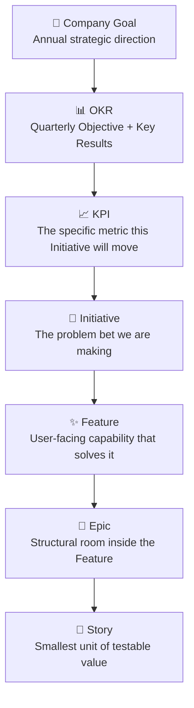
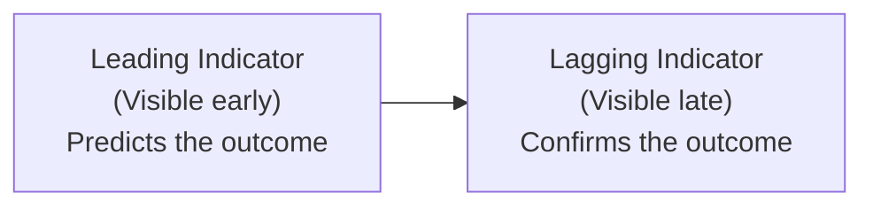

# Business Goals → KPIs → Initiatives

The most common failure in product organizations is not a lack of ideas.

It is the broken chain between what the company wants to achieve and what the team is actually building. When that chain breaks, teams build confidently in the wrong direction. Features ship that nobody asked for. Quarters pass without measurable impact. And the question "why are we building this?" gets answered with "because the CEO mentioned it in a meeting."

This page teaches the chain that fixes that.

---

## The Full Chain

Every story in your backlog should be traceable back up this chain. If a story cannot connect to a KPI, ask whether it should be in the sprint at all.

---

## Layer 1 — Company Goal

Company goals are the annual, directional statements of the business. Set by leadership. Rarely changed mid-year. They describe where the company is going, not how.

**Format:** "We will [direction] in order to [business outcome]."

| Example Company Goal | What it signals |
|---|---|
| "Become the daily-use habit app for professional women." | Retention and engagement are the game |
| "Expand from Israel to the US market this year." | Localization, compliance, and growth are the priority |
| "Reduce cost-per-customer by 30% while maintaining NPS." | Operational efficiency matters as much as features |
| "Dominate the SMB segment before enterprise competitors enter." | Speed and volume over depth |

Company goals do not belong in Jira. They live in a strategy document, a board deck, or an OKR system. But they must be visible to the product team — because every initiative must serve one.

::: warning If you can't name the company goal an initiative serves
Pause. Either the initiative doesn't belong, or the company goals haven't been communicated clearly enough. Both are problems worth surfacing.
:::

---

## Layer 2 — OKR

OKRs (Objectives and Key Results) translate the company goal into a quarterly focus with measurable outcomes.

| Element | What it is | Example |
|---|---|---|
| **Objective** | The qualitative direction for the quarter | "Turn the app into a meaningful daily habit" |
| **Key Result 1** | A measurable signal of success | Weekly active users: 30% → 50% |
| **Key Result 2** | A second measurable signal | Sessions per user per week: 1.2 → 3.0 |
| **Key Result 3** | A third signal | D30 retention: 18% → 30% |

**OKR rules:**
- Each Key Result must be measurable before and after
- A team should have no more than 3 OKRs per quarter
- OKRs are set collaboratively — not handed down from above
- An initiative can contribute to one or more Key Results, but must own at least one

OKRs belong in a quarterly planning document or OKR tool. They are the bridge between leadership's annual vision and the product team's daily execution.

---

## Layer 3 — KPI

A KPI (Key Performance Indicator) is the single specific metric that this Initiative is directly responsible for moving.

One initiative = one primary KPI. This is the forcing function for focus.

### Choosing the Right KPI

Ask these questions before locking in a KPI:

| Question | Why it matters |
|---|---|
| Is it directly influenced by what we're building? | If the team can't move this number, it's the wrong KPI |
| Can we measure it before *and* after? | A baseline is required — no baseline means no measurement |
| Will we know within 4–8 weeks if it's moving? | If it takes 6 months to see, pick a leading indicator |
| Is it a behaviour metric, not a feature metric? | "Ship X features" is not a KPI — it's a task list |
| Does moving this number actually matter to the user? | Vanity metrics (like page views) don't prove value |

### Leading vs Lagging Indicators

| Type | Definition | Example |
|---|---|---|
| **Leading** | Predicts the outcome; visible during the initiative | Journal entries saved per active user per week |
| **Lagging** | Confirms the outcome; visible weeks or months later | 30-day retention rate |

::: tip Use both
Track a **leading indicator** during the initiative to confirm the bet is working.
Track a **lagging indicator** after launch to confirm it *actually* worked.

If the leading indicator moves but the lagging one doesn't, you solved the wrong problem.
:::

### KPI Anti-Patterns

| Anti-Pattern | Problem | Fix |
|---|---|---|
| KPI is "ship the feature" | Measures output, not outcome | Replace with user behaviour metric |
| KPI is set after the initiative starts | No baseline, no measurement | Always set KPI at Station 1 |
| Multiple initiatives share a KPI | Can't attribute what worked | Give each initiative a distinct primary metric |
| KPI is something the team can't influence | Team feels disconnected | Choose a metric the product directly drives |
| KPI is only a lagging indicator | Won't know for months | Add a leading indicator as an early signal |

---

## Layer 4 — Initiative

The Initiative is the product team's response to the KPI problem. It frames the user problem that, if solved, will move the KPI.

**The critical rule:** An Initiative must be framed as a user problem, never a solution.

| ❌ Solution-first (wrong) | ✅ Problem-first (right) |
|---|---|
| "Build a journaling feature" | "Users have no daily ritual that creates emotional connection and drives return visits" |
| "Add push notifications" | "Users forget the app exists between active sessions, reducing weekly engagement" |
| "Improve onboarding" | "60% of SMB trial users never experience core product value and churn within 14 days" |
| "Redesign the dashboard" | "Users cannot understand their financial trends and make decisions from the current data display" |

A properly framed Initiative immediately generates multiple solution options (Station 4) and prevents the team from committing to one approach prematurely.

---

## A Complete Chain — Worked Example

> **Company Goal:**
> Become the daily-use habit app for professional women.

> **OKR — Q2:**
> *Objective:* Turn the app into a meaningful daily ritual.
> - KR1: Weekly active users: 30% → 50%
> - KR2: Sessions/user/week: 1.2 → 3.0
> - KR3: D30 retention: 18% → 30%

> **Primary KPI for this Initiative:**
> Sessions per active user per week (leading indicator — measurable within 4 weeks of launch).
> Secondary: D30 retention (lagging — confirms long-term habit).

> **Initiative Brief:**
> "Active users have no simple, repeatable reason to open the app daily. They return when new content arrives — not because the app has earned a place in their daily routine. This absence of ritual is the primary driver of our flat weekly engagement and poor D30 retention."
>
> Success condition: Avg sessions/user/week ≥ 2.5 within 6 weeks of launch.
> Out of scope: Personalization engine, social features, AI coaching (Phase 2).

> **Feature:** Living Wondrously Journal — a gentle daily reflection ritual

> **Epics:**
> - E1: Entry Creation & Prompt Flow
> - E2: Past Entries (Day/Week/Month)
> - E3: Notifications & Reminders
> - E4: Stars & Habit Loop

> **Story (E1):** "As Maya, I want to write and save a reflection for today's prompt so I can capture my daily moment of meaning."

Every team member can now answer: *Why are we building this?*
The developer knows. The QA engineer knows. The designer knows. When the KPI moves, everyone knows they contributed to it.

---

## How to Define KPIs for Different Initiative Types

Not all initiatives are user-facing features. Here's how to find the right KPI by initiative type:

| Initiative Type | Example | Right KPI Type | Example KPI |
|---|---|---|---|
| **User-facing feature** | Daily journaling ritual | User behaviour | Sessions/user/week |
| **Onboarding improvement** | SMB trial activation | Conversion | Trial → activation rate |
| **Performance / reliability** | API response time | Technical SLA | P95 latency < 200ms |
| **Customer success** | Reduce churn | Business outcome | Monthly churn rate |
| **Internal tool** | Deployment pipeline | Efficiency | Deploy-to-production time |
| **Tech debt** | Database migration | Risk reduction | Query error rate |

---

## Quick Reference

**To connect any new initiative to the business:**

1. Name the **Company Goal** it serves
2. Identify the **OKR** it contributes to (which Key Result?)
3. Pick the **KPI** it will move — one leading + one lagging
4. Frame the Initiative as a **user problem**, not a feature or solution
5. Document the KPI and baseline in the [Initiative Brief](/upstream/initiative-brief) at **Station 1**
6. Revisit the KPI at **Station 5** (Decision & Scope) and confirm the MVP scope can actually move it

If the Initiative Brief doesn't include a KPI with a baseline, it is not ready for Station 5.
