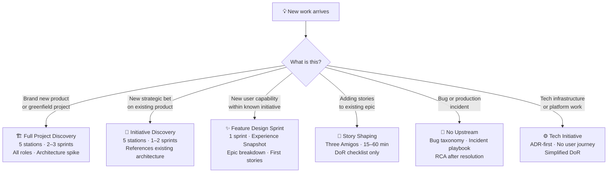
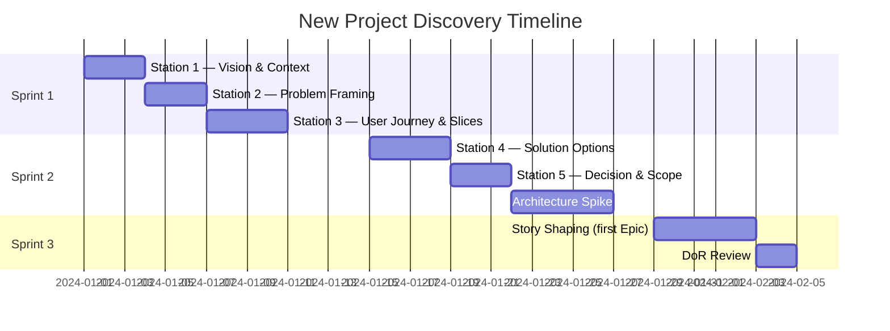
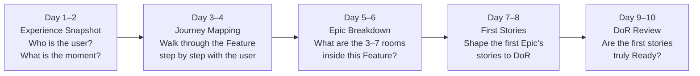
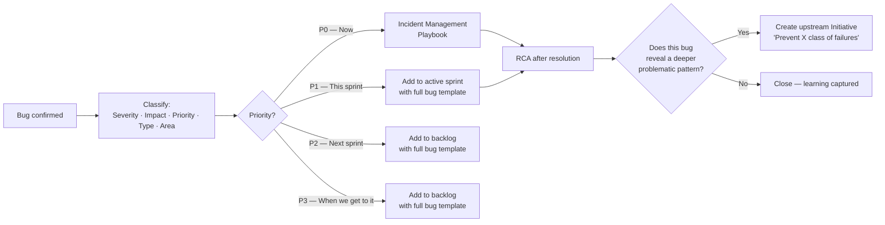

# What Kind of Discovery Do I Need?

Not every new piece of work requires the same depth of discovery.

A brand-new product needs months of structured exploration before a line of code makes sense. A single story added to an existing epic needs a 15-minute conversation. Running full discovery for a simple story is waste. Running no discovery for a complex initiative is risk.

This page maps each type of incoming work to the right level of discovery — so you invest exactly what is needed, and not more.

---

## The Decision Tree

---

## New Project — Full Discovery {#new-project}

**When:** You are starting from nothing. No product, no existing codebase, no established team patterns.

**Triggers:**
- New client engagement
- New product line
- Greenfield startup idea
- Platform rebuild from scratch

**Discovery depth:** Full — all 5 stations, 2–3 discovery sprints

**What you produce:**
- [Initiative Brief](/upstream/initiative-brief) — signed off by all stakeholders
- [User Journey Map](/upstream/user-journey) — full end-to-end
- Architecture Decision Records (ADRs) for major technical choices
- Feature list with Experience Snapshots
- First 2–3 epics with stories that pass the [Definition of Ready](/upstream/definition-of-ready)
- A tech spike result (if technical unknowns exist)

**Team required:**
- Product Manager (owns Stations 1–3)
- Tech Lead (owns Stations 4–5 architecture side)
- Designer/UX (owns Stations 2–3 journey side)
- QA Lead (validates testability at Station 5)
- At least one senior developer (validates feasibility)

**Key decisions made before first sprint:**
1. Target persona and primary user problem
2. MVP scope — what's in, what's explicitly out
3. Core architecture pattern (monolith vs microservices, database choices)
4. Success KPI and measurement plan
5. Rollout strategy (internal beta, limited release, full launch)

::: warning The temptation to rush
New projects attract energy and excitement. The instinct is to start building. Resist it. Every hour of discovery at this stage saves five hours of rework downstream. The initiative brief is not bureaucracy — it is your contract with reality.
:::

---

## New Initiative — Strategic Discovery {#new-initiative}

**When:** A product already exists, and a new strategic bet is being made. Not an incremental improvement — a new problem space.

**Triggers:**
- A new market segment is targeted
- A competitor gap is identified
- Analytics reveal a systemic user problem
- A client commitment requires a major new capability
- Offstream signals (support tickets, NPS themes, churn patterns) expose a persistent gap

**Discovery depth:** Full 5 stations — typically 1–2 sprints

**Differences from New Project:**

| Aspect | New Project | New Initiative |
|---|---|---|
| Architecture | Start from scratch | Reference existing system |
| ADRs | Multiple, foundational | Focused on net-new decisions |
| Team | Fully assembled for the first time | Existing team with established patterns |
| Constraint mapping | Wide open | Constrained by existing platform |
| Timeline | 2–3 sprints | 1–2 sprints |

**What you produce:**
- Initiative Brief with KPI baseline
- Problem framing with assumption register
- User Journey (focused on the new problem area)
- 2–3 solution options with tradeoffs (ADR if major)
- MVP scope decision
- 1 Epic fully story-mapped and Ready

**Watch for:**
- The initiative that grows to swallow existing initiatives — check scope aggressively at Station 5
- Hidden dependencies on other teams' work — surface these at Station 4
- The assumption that existing architecture can absorb the new initiative without modification — always validate with the Tech Lead

---

## New Feature — Feature Design Sprint {#new-feature}

**When:** An initiative is already approved and underway. A new user-facing capability needs to be added — something a user can *do* that they couldn't do before.

**Triggers:**
- An approved initiative has more features to define
- A user research session reveals a specific capability gap
- A client requests a specific experience (within an approved initiative)
- The team completes one feature and turns to the next in the initiative

**Discovery depth:** 1 sprint focused on the Feature layer

**The Feature Design Sprint:**

**What you produce:**
- [Experience Snapshot](/upstream/experience-snapshot) — the day-in-the-life narrative
- Feature brief (purpose, emotional aim, in/out of scope)
- High-level user flow (no UI yet)
- Epic list with ownership and sequencing
- First Epic's stories fully shaped to DoR

**What you do NOT produce yet:**
- Pixel-level designs (those come in Downstream, story by story)
- Code or technical implementation
- Stories for Epics 2+ (shape these when you need them)

**The Experience Snapshot is required.** If the team cannot write a coherent day-in-the-life story for a fictional user, the Feature is not clear enough to break into epics. Stop and clarify the Feature before proceeding.

---

## New Story — Story Shaping {#new-story}

**When:** An Epic is underway. You need to add or refine specific stories within it.

**Triggers:**
- Sprint planning reveals stories aren't quite ready
- A new edge case surfaces during development that requires a new story
- An existing story gets split because it's too large
- Upstream backlog refinement for the next sprint

**Discovery depth:** Three Amigos session — 15 to 60 minutes

**The Three Amigos Format:**

| Role | Their question |
|---|---|
| **Product Manager** | "What does the user need to be able to do?" |
| **Developer** | "What do we need to build, and are there technical constraints?" |
| **QA Engineer** | "How will we know when this is done? What could go wrong?" |

**Process:**
1. PM presents the story in user-story format
2. Dev raises technical questions and feasibility concerns
3. QA writes candidate Gherkin scenarios (Given/When/Then)
4. Group resolves edge cases, failure states, and design states
5. Story is updated with agreed acceptance criteria
6. DoR checklist run to confirm it's Ready

**Duration guide:**

| Story type | Expected duration |
|---|---|
| Simple CRUD story | 15 minutes |
| Business logic story | 30 minutes |
| Integration or external dependency story | 45–60 minutes |
| Story with complex states or error handling | 60 minutes |

If a Three Amigos session exceeds 60 minutes, the story is probably too large. Split it.

**What comes out:**
- Updated story with acceptance criteria
- Gherkin scenarios drafted
- Edge cases and failure states documented
- Design states identified (empty, loading, error, success)
- Story confirmed as meeting DoR — or returned to Upstream with specific gaps named

---

## Bug / Hotfix — No Upstream {#bug}

**When:** Something is broken in production or staging. A user-facing defect has been confirmed.

**Discovery depth:** None — go directly to [Bug Taxonomy](/onstream/bug-taxonomy) and [Downstream](/downstream/)

**The bug workflow:**

**Key rules for bugs:**
- Every P0 and P1 requires an RCA within 48 hours
- Every bug must be classified on all 5 dimensions before entering the sprint
- If the same bug class appears 3 or more times, it becomes an upstream initiative
- Hotfixes still require a code review — do not bypass the DoD in an emergency

---

## Tech Initiative — Infrastructure and Platform Work {#tech}

**When:** The work is technical in nature — no user-facing feature, but important for the platform's health, security, or future capability.

**Triggers:**
- Tech debt that's causing delivery slowdowns
- Security vulnerability remediation
- Platform migration (database, cloud provider, framework)
- Developer tooling improvements
- Observability and monitoring gaps

**Discovery depth:** ADR-first — simplified Initiative Brief, no user journey

**The Tech Initiative Brief:**

Unlike product initiatives, tech initiatives don't have user journeys. They have:

| Section | Content |
|---|---|
| **Technical problem** | What is the current state? What does it cost us? |
| **Risk if we don't fix it** | Security exposure? Velocity impact? Reliability risk? |
| **Proposed approach** | The ADR — options evaluated, decision recorded |
| **Success condition** | How do we know we're done? (Technical metrics) |
| **Dependencies** | What product work is blocked until this is complete? |

**What you still need:**
- An ADR (Architecture Decision Record) for the chosen approach
- Subtasks broken to 1–3 day chunks
- A Definition of Done that includes tests, documentation, and runbook updates
- A rollback plan

**What you skip:**
- User journey mapping
- Experience Snapshot
- Persona definition

::: info Tech debt that affects users is a product initiative
If tech debt is directly causing user-visible problems (slow load times, flaky features, data errors), it may warrant a product initiative framing. Use the user-visible outcome to justify priority to stakeholders.
:::

---

## Summary Table

| Work Type | Discovery Depth | Time | Key Output |
|---|---|---|---|
| **New Project** | Full — 5 stations | 2–3 sprints | Initiative Brief + Architecture + Ready stories |
| **New Initiative** | Full — 5 stations | 1–2 sprints | Initiative Brief + Journey + First Epic Ready |
| **New Feature** | Feature Design Sprint | 1 sprint | Experience Snapshot + Epic breakdown + First stories |
| **New Story** | Three Amigos | 15–60 min | DoR-passing story with Gherkin |
| **Bug / Hotfix** | None | Immediate | Bug template + RCA |
| **Tech Initiative** | ADR-first | 1 sprint planning | ADR + Tech Brief + Subtasks |
