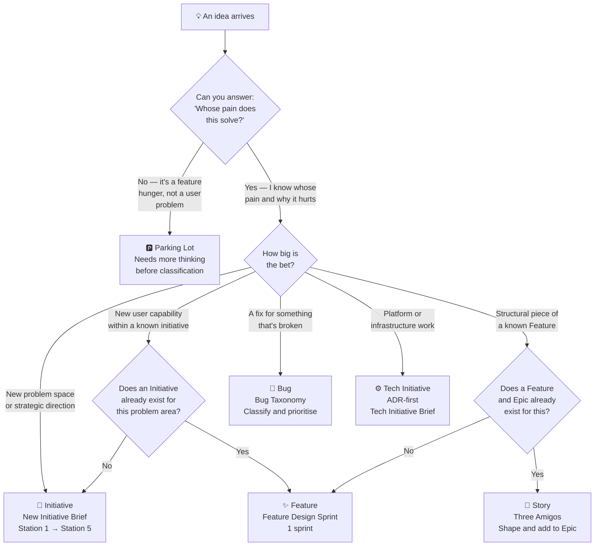

# Idea Triage — Where Does This Idea Belong?

Ideas arrive constantly and from everywhere.

A developer notices something in a code review. A client mentions something in a call. A support agent flags a pattern. The CEO forwards a competitor's announcement. A designer gets inspired. Someone posts in Slack: "What if we..."

The idea itself is not the problem. Ideas are the raw material of product work. The problem is what happens next — when ideas skip classification and land directly in the backlog as vague tasks, misframed epics, or oversized stories that nobody can scope.

This page teaches how to classify an idea in minutes and route it to the right place.

---

## The Triage Decision Tree

---

## How to Use the Triage

Work through these questions in order. Stop at the first one that gives you a clear answer.

### Question 1: Can you articulate the user's problem?

Before anything else: **what is the human pain this addresses?**

Not "what feature does this add" — what is the user currently unable to do, experiencing frustration with, or missing entirely?

| If you can say... | ...it's probably this |
|---|---|
| "Users of type X cannot currently do Y, which means they experience Z pain" | Ready for classification |
| "It would be cool if we added X" | Parking lot — find the pain first |
| "The CEO wants X" | Needs problem framing — find the user pain behind the executive request |
| "Competitors have X" | Valid signal — but still needs user problem translation |

::: tip The translation exercise
Take any idea and ask: "What is the user doing *today* without this? What is that costing them?"
If you can answer that in one sentence, you have a problem worth solving.
If you can't, put it in the parking lot.
:::

---

### Question 2: Is this a new problem space or an addition to something known?

| Signal | Classification |
|---|---|
| The team has never worked on this user problem before | **Initiative** |
| A new user segment is being targeted for the first time | **Initiative** |
| The problem has been known but never formally addressed | **Initiative** |
| The work sits clearly inside an existing approved initiative | **Feature or Story** |
| It's a refinement of something the team is already building | **Epic or Story** |

---

### Question 3: How long would it take to deliver?

This is a rough signal, not a binding rule:

| Rough delivery size | Likely layer |
|---|---|
| Months — multiple sprints, multiple features | Initiative |
| Weeks — one sprint of discovery + several sprints of delivery | Feature |
| Days — fits inside a sprint, tied to an existing epic | Story |
| Hours — a fix, a config change, a single adjustment | Sub-task or Bug |

---

## Layer-by-Layer Classification Guide

### When it's an Initiative

An idea is an **Initiative** when:

- It addresses a problem the team hasn't tackled before
- Success requires building multiple Features
- The team needs to validate assumptions before committing to a solution
- The business will measure impact in terms of KPIs (retention, conversion, revenue, reliability)
- It represents a strategic bet for the quarter

**Examples of correctly classified Initiatives:**
- "Users don't return to the app daily — we need to create a daily ritual" ✅
- "60% of SMB trials fail to activate — we need to fix the onboarding gap" ✅
- "We're losing enterprise deals because we lack audit log functionality" ✅

**Examples of things that sound like Initiatives but aren't:**
- "Build a notification system" ❌ — that's a Feature (inside what Initiative?)
- "Improve performance" ❌ — that's a goal, not a problem statement
- "Redesign the dashboard" ❌ — that's a solution, not an initiative

**Routing:** → [Station 1 — Vision & Context](/upstream/station-1-vision)

---

### When it's a Feature

An idea is a **Feature** when:

- An Initiative already exists and this is a user-facing capability within it
- You can describe it as "the user can now do X" where X is the full experience
- It will break into 3–7 Epics
- It has a coherent Experience Snapshot (a day-in-the-life narrative)

**Examples of correctly classified Features:**
- "Users can write a daily reflection and track their ritual over time" ✅ (inside a "daily engagement" initiative)
- "Managers can approve team expenses directly from a notification" ✅ (inside an "expense workflow" initiative)
- "Users can see their real-time balance across all wallets" ✅ (inside a "financial clarity" initiative)

**Examples of things mislabelled as Features:**
- "Add balance API endpoint" ❌ — that's an Epic (it's the technical piece of a Feature)
- "Fix the loading state on the dashboard" ❌ — that's a Story
- "User notifications" ❌ — is this a Feature? What initiative does it serve?

**Routing:** → [Feature Design Sprint](/upstream/discovery-types#new-feature) → [Experience Snapshot](/upstream/experience-snapshot)

---

### When it's an Epic

An idea is an **Epic** when:

- A Feature exists and this is a structural, coherent chunk of it
- It maps to one or more steps in the user journey
- It will break into 5–15 Stories
- It has a clear scope boundary (where it starts and stops)

**Examples of correctly classified Epics:**
- "E1: Entry Creation & Prompt Flow" (inside the Journal Feature) ✅
- "E2: Past Entries — Day/Week/Month view" ✅
- "Authentication & Session Management" ✅

**When to create an Epic vs a Story:**
- If the work spans more than one sprint — Epic
- If it requires architectural design decisions — Epic
- If it requires multiple roles (design + backend + frontend) — Epic
- If it fits in 1–3 days of one person's work — Story

**Routing:** → Directly add to the relevant Feature in Jira/Confluence; shape stories within it

---

### When it's a Story

An idea is a **Story** when:

- An Epic exists and this is a single, testable user action within it
- It satisfies INVEST (Independent, Negotiable, Valuable, Estimable, Small, Testable)
- A developer can complete it in 1–3 days
- QA can write clear pass/fail criteria for it

**Examples of correctly classified Stories:**
- "User can write and save a reflection for today's prompt" ✅
- "User sees an error message when saving fails due to offline status" ✅
- "Admin can filter expense requests by status and date range" ✅

**Examples of things mislabelled as Stories:**
- "Implement the whole journaling feature" ❌ — that's a Feature
- "Adjust the API endpoint" ❌ — that's a sub-task, not a user story
- "As a user, I want a better dashboard" ❌ — not testable, not small

**Routing:** → [Story Shaping / Three Amigos](/upstream/discovery-types#new-story)

---

### When it's a Bug

An idea is a **Bug** when:

- A feature exists and is behaving incorrectly relative to its acceptance criteria
- The issue is a defect — not a new capability request
- It was discovered in production, staging, or during QA

**The key distinction:** Is this "it doesn't work" or "we want something new"?

- "The balance shows $0.00 when it should show -$50.00" → **Bug** (defect against AC)
- "We should show a projected balance too" → **Feature request** (new capability)

**Routing:** → [Bug Taxonomy](/onstream/bug-taxonomy) → [Downstream sprint or incident management]

---

## The Parking Lot

Not every idea is ready to be classified. Some need to sit until more information arrives.

An idea goes to the **parking lot** when:
- You can't articulate the user problem yet
- The idea depends on something that hasn't been decided (strategy, a prior initiative, external factor)
- It's interesting but there's no time, capacity, or business case for it this quarter

**How to park an idea properly:**
1. Capture it with its source ("CEO mentioned in Q1 all-hands")
2. Tag it with the closest problem area
3. Set a review date (quarterly backlog review)
4. Don't let it evaporate — parked ideas often become next quarter's initiatives

---

## Quick Reference Card

| What you have | What it is | Where it goes |
|---|---|---|
| A user problem with a KPI | Initiative | Station 1 |
| A user-facing capability inside an initiative | Feature | Feature Design Sprint |
| A structural chunk of a known Feature | Epic | Add to Feature, shape stories |
| A single user action in an existing Epic | Story | Three Amigos |
| A defect against accepted behaviour | Bug | Bug taxonomy |
| A platform, infra, or tooling need | Tech Initiative | ADR-first |
| Something cool with no clear user problem | Parking Lot | Review quarterly |
